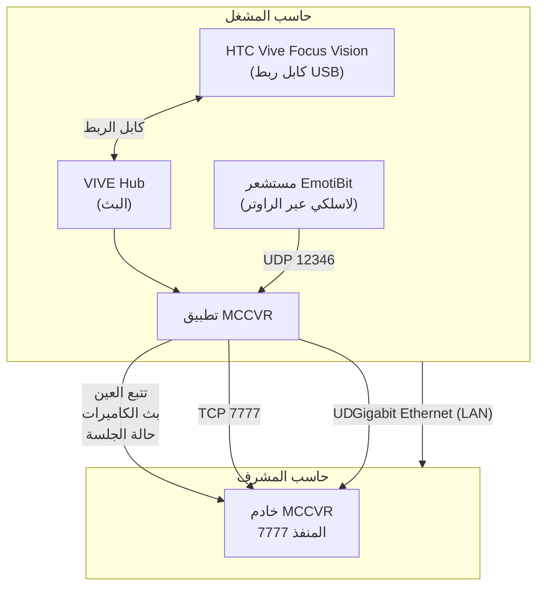

## **دليل إعداد المشغل MCC**

مركز المراقبة والتحكم (MCC)

الإصدار 1.2 | مارس 2026

## **جدول المحتويات**

1. المقدمة
2. متطلبات الأجهزة
3. المتطلبات البرمجية المسبقة
4. إعداد HTC Vive Focus Vision
5. إعداد مستشعر EmotiBit
6. تهيئة الشبكة
7. تهيئة وضع المشغل
8. الانضمام لجلسة
9. أثناء جلسة التدريب
10. مخرجات البيانات وهيكل الملفات
11. استكشاف الأخطاء
12. الملحق أ: مرجع المنافذ
13. الملحق ب: علامات مستشعر EmotiBit
14. الملحق ج: المصطلحات

## **1. المقدمة**

## **1.1 ما هو MCC؟**

MCC (مركز المراقبة والتحكم) هو محاكي تدريب بالواقع الافتراضي مبني على Unreal Engine 5.6. يتيح المراقبة الفورية لعدة مشغلي واقع افتراضي بواسطة مشرف مركزي. يلتقط النظام البيانات الحيوية وتتبع العين وبث كاميرات المراقبة وإجراءات المشغل لتحليل التدريب.

## **1.2 دور المشغل**

المشغل هو المتدرب المنغمس في بيئة الواقع الافتراضي. حاسب المشغل:

- **يتصل بجلسة المشرف** كعميل شبكة
- **يشغل سيناريو التدريب بالواقع الافتراضي** المبثوث لنظارة HTC Vive Focus Vision
- **يلتقط بيانات تتبع العين** عبر تتبع العين المدمج في النظارة و OpenXR
- **يجمع البيانات الحيوية** من مستشعر EmotiBit القابل للارتداء (معدل ضربات القلب، التوصيل الكهربائي للجلد، الحرارة، إلخ) **يبث كاميرات مباشرة** للمشرف عبر UDP

**يسجل جميع الإجراءات والتفاعلات** لتحليل ما بعد الجلسة

## **1.3 معمارية النظام**



## **2. متطلبات الأجهزة**

## **2.1 حاسب قادر على الواقع الافتراضي**

|**المكون**|**الحد الأدنى**|**الموصى به**|
|---|---|---|
|**نظام التشغيل**|Windows 10 64-bit|Windows 11 64-bit|
|**المعالج**|Intel i7 / AMD Ryzen 7 (6+ أنوية)|Intel i9 / AMD Ryzen 9 (8+ أنوية)|
|**الذاكرة**|16 GB|32 GB|
|**بطاقة الرسومات**|NVIDIA RTX 2060 8GB (DX12, SM6)|NVIDIA RTX 3070 أو أفضل|
|**التخزين**|100 GB SSD|256+ GB NVMe SSD|
|**الشبكة**|منفذ Gigabit Ethernet|منفذ Gigabit Ethernet|
|**WiFi**|WiFi 5 (لبث VR + EmotiBit)|راوتر WiFi 6/6E (لبث VR بتأخير منخفض)|

_**يجب أن تدعم بطاقة الرسومات DirectX 12 مع Shader Model 6 (SM6).** يوصى ببطاقات سلسلة NVIDIA RTX. يجب تحديث تعريفات بطاقة الرسومات._

## **2.2 HTC Vive Focus Vision**

|**المكون**|**التفاصيل**|
|---|---|
|**النظارة**|HTC Vive Focus Vision (مستقلة مع بث VR من الحاسب)|
|**التتبع**|من الداخل للخارج (4 كاميرات مدمجة - لا حاجة لمحطات أساسية)|
|**تتبع العين**|مدمج (كاميرتان لتتبع العين مع IPD تلقائي)|
|**اتصال الحاسب**|بث WiFi 6/6E عبر VIVE Hub (موصى به)|
|**اتصال بديل**|طقم بث سلكي VIVE اختياري (USB-C مع DP 1.4 Alt Mode)|
|**أدوات التحكم**|2x أدوات تحكم Vive Focus (اختيارية، حسب السيناريو)|
|**الشحن**|كابل شحن USB-C (مشمول)|

_**لا حاجة لمحطات أساسية.** يستخدم Vive Focus Vision التتبع من الداخل للخارج بـ 4 كاميرات على متن النظارة. هذا يبسط الإعداد بشكل كبير مقارنة بنظارات Vive السابقة._

## **2.3 مستشعر EmotiBit**

|**المكون**|**التفاصيل**|
|---|---|
|**الجهاز**|EmotiBit MD (أو طراز متوافق مع WiFi)|
|**المشمول**|لوحة المستشعر، موصل الأقطاب، حزام معصم/ذراع، بطاقة microSD|
|**WiFi**|درع WiFi مدمج (2.4 GHz فقط)|
|**البطارية**|بطارية قابلة لإعادة الشحن مدمجة (شحن USB-C)|

**الوضع** الساعد الداخلي (موصى به لقراءات EDA المثلى)

## **2.4 البنية التحتية للشبكة**

**كابل Ethernet** - يربط حاسب المشغل بمحول/راوتر الشبكة المحلية

**راوتر WiFi** - يجب أن يدعم WiFi 5 أو WiFi 6/6E. يبث Vive Focus Vision VR من الحاسب عبر WiFi. يتصل EmotiBit أيضا عبر WiFi (2.4 GHz). يجب أن تكون كل من النظارة و EmotiBit على نفس الشبكة مع حاسب المشغل.

**محول/راوتر LAN** - لربط جميع الأجهزة معا

_**نصيحة:** لأفضل أداء بث VR، وصل حاسب المشغل بالراوتر عبر Ethernet وتأكد من خط رؤية واضح بين راوتر WiFi ونظارة Vive Focus Vision._

## **3. المتطلبات البرمجية المسبقة**

## **3.1 البرمجيات المطلوبة**

|**البرنامج**|**الإصدار**|**الغرض**|**مصدر التحميل**|
|---|---|---|---|
|**Windows 10/11**|64-bit|نظام التشغيل|--|
|**تعريفات GPU**|الأحدث|دعم DX12 + SM6|nvidia.com / amd.com|
|**Steam**|الأحدث|منصة SteamVR|store.steampowered.com|
|**SteamVR**|أحدث مستقر|بيئة تشغيل VR + OpenXR|عبر متجر Steam (مجاني)|
|**VIVE Hub**|الأحدث|بث VR من الحاسب لـ Vive Focus Vision|vive.com|
|**EmotiBit Oscilloscope**|الأحدث|تهيئة EmotiBit + البث|github.com/EmotiBit/ofxEmotiBit/releases|
|**Visual C++ Redist**|2022|اعتمادية تشغيل UE5|مشمول مع البناء|

## **3.2 ترتيب التثبيت**

ثبت البرمجيات بهذا الترتيب لتجنب مشاكل الاعتمادية:

1. تعريفات GPU (إعادة تشغيل بعد التثبيت)
2. Steam
3. SteamVR (تثبيت عبر Steam)
4. VIVE Hub
5. EmotiBit Oscilloscope
6. تطبيق MCC

## **4. إعداد HTC Vive Focus Vision**

## **4.1 الإعداد الأولي للنظارة**

1. **اشحن النظارة** بالكامل باستخدام كابل USB-C المشمول قبل الاستخدام الأول
2. **شغل النظارة** بالضغط مع الاستمرار على زر التشغيل
3. **أكمل معالج الإعداد على النظارة:**
   - اختر اللغة
   - اتصل بـ WiFi (استخدم نفس شبكة WiFi كحاسب المشغل)
   - سجل دخول بحساب HTC/VIVE الخاص بك (أو أنشئ واحدا)
   - وافق على الشروط والأحكام
   - أكمل تحديث البرنامج الثابت الأولي إذا طلب

## **4.2 إعداد منطقة اللعب / الحدود**

يستخدم Vive Focus Vision **التتبع من الداخل للخارج** - يتتبع موقعك باستخدام 4 كاميرات على النظارة. لا حاجة لمحطات أساسية خارجية.

**إعداد منطقة اللعب:**

1. **ارتد النظارة** - ستطلب منك إعداد حدود عند الحاجة
2. **أكد مستوى الأرضية** - انظر للأرض وأكد ارتفاع الأرضية المكتشف
3. **اختر نوع منطقة اللعب:**
   **ثابت** - للسيناريوهات الجالسة أو الواقفة في المكان (مساحة أصغر)
   **بحجم الغرفة** - للتجول (حد أدنى 1.5م × 1.5م موصى به)
4. **ارسم حدودك** (بحجم الغرفة):
   وجه أداة التحكم نحو الأرض
   اضغط مع الاستمرار على الزناد عند نقطة البداية
   امش حول محيط منطقة اللعب مع الاستمرار في الضغط على الزناد
   اترك عند العودة لنقطة البداية
5. **أكد الحدود** - سيعرض النظام معاينة

## **نصائح لتحسين التتبع:**

تأكد من إضاءة كافية للغرفة (مشرقة بما يكفي لقراءة كتاب)

تجنب الضوء المباشر الشديد أو الانعكاس على كاميرات النظارة

- استخدم غرف بأنماط مرئية على الجدران والأرضية والسقف (الجدران البيضاء بدون ملامح تقلل جودة التتبع)
  ابق منطقة اللعب خالية من العوائق

يمكنك إعداد حتى 3 مناطق لعب محفوظة مختلفة

## **4.3 تثبيت VIVE Hub على الحاسب**

VIVE Hub هو البرنامج الذي يتيح بث VR من حاسب المشغل لنظارة Vive Focus Vision.

1. **حمل VIVE Hub** من vive.com
2. **ثبته وشغله** على حاسب المشغل
3. **سجل دخول** بنفس حساب HTC/VIVE المستخدم على النظارة

## **4.4 توصيل النظارة بالحاسب (بث لاسلكي)**

هذه هي **طريقة الاتصال الموصى بها** لـ MCC:

1. **تأكد من توصيل حاسب المشغل عبر Ethernet** بنفس الراوتر الذي يوفر WiFi للنظارة
2. **شغل VIVE Hub** على حاسب المشغل
3. **على النظارة**، افتح تطبيق البث VIVE (في مكتبة تطبيقات النظارة)
4. **ستكتشف النظارة الحاسب** الذي يشغل VIVE Hub على نفس الشبكة
5. **اختر حاسبك** من القائمة وانقر اتصال
6. **تحمل بيئة VR** - أنت الآن تبث VR من الحاسب للنظارة
7. **يبدأ SteamVR تلقائيا** على الحاسب كجزء من جلسة البث

## _**متطلبات WiFi لأفضل جودة بث:**_

_راوتر WiFi 6 (802.11ax) أو WiFi 6E موصى به_

- _الحاسب متصل بالراوتر عبر Ethernet (وليس WiFi)_
- _نطاق WiFi 5 GHz للنظارة (2.4 GHz بطيء جدا لبث VR)_
- _خط رؤية واضح بين النظارة والراوتر - تقليل الأجهزة الأخرى على نفس نطاق WiFi_

## **4.5 البديل: البث السلكي (اختياري)**

إذا كانت جودة بث WiFi غير كافية، يمكنك استخدام **طقم البث السلكي VIVE** الاختياري:

1. **اشتر طقم البث السلكي VIVE** بشكل منفصل من HTC
2. **وصل كابل USB-C** من طقم البث للنظارة وللحاسب
3. **يجب أن يدعم الحاسب USB 3.2 Gen 2 مع DisplayPort 1.4 Alternate Mode** على منفذ USB-C
4. **شغل VIVE Hub** - سيكتشف الاتصال السلكي تلقائيا
5. **اختر البث السلكي** عند المطالبة

_**متى تستخدم السلكي:** السيناريوهات كثيفة الرسومات، البيئات ذات تداخل WiFi، أو عندما يكون أقل تأخير مطلق مطلوبا._

## **4.6 ضبط SteamVR كبيئة تشغيل OpenXR النشطة**

هذا أمر حيوي لعمل MCC بشكل صحيح:

1. افتح **إعدادات SteamVR** (أيقونة الترس في نافذة SteamVR)
2. انتقل لتبويب **المطور**
3. انقر **"ضبط SteamVR كبيئة تشغيل OpenXR"**
4. تحقق من أن الرسالة تؤكد أن SteamVR هي بيئة تشغيل OpenXR النشطة

_**لماذا هذا مهم:** يستخدم MCC OpenXR كواجهة VR. إذا كانت بيئة تشغيل أخرى مضبوطة كافتراضية، قد لا يعمل التطبيق بشكل صحيح._

## **4.7 إعداد تتبع العين**

يحتوي Vive Focus Vision على **تتبع عين مدمج** بكاميرتين مخصصتين لتتبع العين. يتيح هذا لـ MCC التقاط بيانات النظر والتثبيتات والرمشات السريعة.

## **معايرة تتبع العين:**

1. **على النظارة**، اذهب للإعدادات > تتبع العين
2. **شغل معايرة تتبع العين** - اتبع النقاط على الشاشة بعينيك
3. **تكتمل المعايرة** في حوالي 15 ثانية
4. **أعد المعايرة** إذا:
   عدلت موقع النظارة بشكل كبير
   غيرت إعداد IPD (المسافة بين الحدقتين)
   لاحظت أن تتبع العين يبدو غير دقيق

_**IPD تلقائي:** يستخدم Vive Focus Vision تتبع العين لقياس وضبط IPD تلقائيا للوضوح البصري الأمثل._

## **معاملات تتبع العين في MCC (مهيأة مسبقا):**

حد أدنى لثقة النظر: 0.6 (البيانات ذات الثقة الأقل تتجاهل)

عتبة اكتشاف الرمشة السريعة: 3.0 درجات
تنعيم النظر: ألفا مزدوج (بطيء: 0.15، سريع: 0.6)
عتبة التثبيت: 0.5 ثانية

هذه معرفة في `DefaultOpenXR.ini` ولا تتطلب تغييرات يدوية.

## **5. إعداد مستشعر EmotiBit**

## **5.1 ما هو EmotiBit؟**

EmotiBit هو مستشعر حيوي قابل للارتداء مفتوح المصدر يلتقط إشارات فسيولوجية متعددة. يستخدم MCC مستشعر EmotiBit لمراقبة إجهاد المشغل والإثارة والحالة الفسيولوجية أثناء التدريب.

## **البيانات التي يجمعها MCC من EmotiBit:**

|**المقياس**|**العلامة**|**الوصف**|
|---|---|---|
|معدل ضربات القلب|HR|نبضات في الدقيقة|
|الفاصل بين النبضات|BI|الوقت بين ضربات القلب (مللي ثانية)|
|قيمة EDA|EA|النشاط الكهربائي للجلد (التوصيل الكهربائي)|
|مستوى EDA|EL|مستوى التوصيل الكهربائي الأساسي للجلد|
|الحرارة|T1|حرارة الجلد|
|سعة SCR|SA|حجم استجابة التوصيل الكهربائي للجلد|
|تردد SCR|SF|معدل استجابات التوصيل الكهربائي للجلد|
|وقت صعود SCR|SR|الوقت لذروة حدث SCR|
|PPG بالأشعة تحت الحمراء|PI|تخطيط ضوئي (أشعة تحت حمراء)|
|PPG أحمر|PR|تخطيط ضوئي (أحمر)|
|PPG أخضر|PG|تخطيط ضوئي (أخضر)|
|مقياس التسارع|AX, AY, AZ|الحركة (3 محاور)|
|الجيروسكوب|GX, GY, GZ|الدوران (3 محاور)|
|المغناطيسية|MX, MY, MZ|المجال المغناطيسي (3 محاور)|
|البطارية|BInfo|حالة البطارية|
|الحالة|ES|حالة الجهاز|

## **5.2 تجميع الأجهزة**

1. **اشحن EmotiBit** بالكامل قبل الاستخدام (شحن USB-C)
2. **ثبت EmotiBit** على حزام الذراع/المعصم المشمول
3. **وصل أسلاك الأقطاب** (إذا كنت تستخدم أقطاب EDA)
4. **وضع الحزام:** الساعد الداخلي، حوالي 5 سم فوق المعصم - تأكد من تلامس جيد مع الجلد لقراءات EDA - يجب أن يكون المستشعر محكما لكن ليس ضيقا
5. **شغل EmotiBit** (اضغط الزر على اللوحة)

## **5.3 تهيئة WiFi لأول مرة**

يستخدم EmotiBit تهيئة WiFi عبر بطاقة SD. يجب تعديل ملف إعداد على بطاقة microSD قبل أن يتمكن المستشعر من الاتصال بشبكة WiFi.

_**مهم:** يدعم EmotiBit **نطاق WiFi 2.4 GHz فقط**. لن يتصل بشبكات 5 GHz. تأكد من تمكين 2.4 GHz على الراوتر أو نقطة الوصول._

## **الإجراء خطوة بخطوة:**

1. **حمل قالب ملف الإعداد** من https://www.emotibit.com/files/config - يحمل ملف باسم `config.txt`
2. **افتح `config.txt` في محرر نصوص** (Notepad على Windows). يحتوي الملف على:

```
{
"WifiCredentials": [
    {"ssid": "myWifiNetwork", "password": "myPassword"}
  ]
}
```

## 3. **عدل بيانات WiFi:**

استبدل `myWifiNetwork` باسم شبكة WiFi الفعلي (SSID)

استبدل `myPassword` بكلمة مرور WiFi الفعلية

لا تغير تنسيق JSON (ابق جميع علامات الاقتباس والأقواس كما هي)
مثال لشبكة باسم "LabWiFi" بكلمة مرور "Training2026":

```
{
"WifiCredentials": [
    {"ssid": "LabWiFi", "password": "Training2026"}
  ]
}
```

## 4. **اختياري: إضافة شبكات متعددة** (EmotiBit يتصل تلقائيا بأي شبكة في النطاق):

```
{
"WifiCredentials": [
    {"ssid": "LabWiFi", "password": "Training2026"},
    {"ssid": "OfficeWiFi", "password": "Office1234"}
  ]
}
```

## 5. **أزل بطاقة microSD** من EmotiBit

6. **أدخل بطاقة microSD** في قارئ بطاقات USB متصل بحاسبك

7. **انسخ `config.txt` المعدل** إلى **الدليل الجذري** لبطاقة microSD (ليس داخل أي مجلد فرعي)

_**تحذير: امتدادات الملفات المزدوجة.** قد يخفي Windows امتدادات الملفات، مما يسبب حفظ الملف كـ `config.txt.txt`. لتجنب هذا:_

_افتح مستكشف الملفات > عرض > حدد "امتدادات أسماء الملفات" - تحقق من أن الملف مسمى بالضبط `config.txt` وليس `config.txt.txt`_

_**تحذير: التنزيلات المعاد تسميتها.** قد يحفظ المتصفح الملف كـ `config(1).txt`. أعد تسميته بالضبط إلى `config.txt` قبل النسخ لبطاقة SD._

8. **أخرج بطاقة SD بأمان** من الحاسب
9. **أدخل بطاقة microSD مجددا** في EmotiBit
10. **اضغط زر إعادة التشغيل** أعلى لوحة Adafruit Feather على EmotiBit
11. **انتظر 5-10 ثوان** للتشغيل. إذا كانت البيانات صحيحة وشبكة WiFi في النطاق، يتصل EmotiBit تلقائيا

## 12. **تحقق من الاتصال باستخدام مؤشرات LED:**

|**LED**|**اللون**|**المعنى**|
|---|---|---|
|LED WiFi|**أخضر (ثابت)**|متصل بـ WiFi بنجاح|
|LED Oscilloscope|**أزرق**|متصل ببرنامج EmotiBit Oscilloscope|
|LED التسجيل|**أحمر (وامض)**|جلسة تسجيل نشطة|

إذا لم يضئ LED WiFi الأخضر بعد 10 ثوان، تحقق مرة أخرى من:

ملف `config.txt` منسق بشكل صحيح (JSON صالح)

- SSID وكلمة المرور صحيحان
- شبكة WiFi هي 2.4 GHz (وليست 5 GHz فقط)
- EmotiBit في نطاق WiFi

## **5.4 إعداد EmotiBit Oscilloscope**

EmotiBit Oscilloscope هو تطبيق سطح المكتب المصاحب للاتصال بـ EmotiBit وتصور بياناته وبثها.

## **التثبيت:**

1. حمل أحدث إصدار من https://github.com/EmotiBit/ofxEmotiBit/releases
2. على Windows، شغل مثبت `.msi`
3. شغل **EmotiBit Oscilloscope**

## **الاتصال بـ EmotiBit:**

1. تأكد من تشغيل EmotiBit واتصاله بـ WiFi (LED أخضر مضاء)
2. افتح EmotiBit Oscilloscope
3. سيكتشف التطبيق EmotiBit على الشبكة تلقائيا
4. اختر EmotiBit الخاص بك من قائمة الأجهزة
5. انقر **اتصال** - يجب أن يضيء LED الأزرق على EmotiBit
6. يجب أن ترى الآن رسوم بيانية حية للمستشعرات (معدل ضربات القلب، EDA، الحرارة، إلخ)

- _**ملاحظة جدار الحماية:** عند تشغيل EmotiBit Oscilloscope لأول مرة، قد يطلب Windows السماح بالوصول للشبكة. انقر "سماح" - هذا مطلوب لاتصال التطبيق بـ EmotiBit._

## **5.5 تهيئة بث UDP لـ MCC**

يستقبل MCC بيانات EmotiBit على **منفذ UDP 12346**. هيئ EmotiBit Oscilloscope لبث البيانات:

1. في EmotiBit Oscilloscope، انتقل إلى **الإخراج / إعدادات البث**

## 2. **فعل بث UDP للإخراج**

3. **اضبط الهدف:**

**عنوان IP:** `127.0.0.1` (المضيف المحلي - لأن MCC و Oscilloscope يعملان على نفس الحاسب)
**المنفذ:** `12346`

4. **فعل جميع تيارات المستشعرات** (HR, EDA, الحرارة, PPG, مقياس التسارع, الجيروسكوب, المغناطيسية, SCR)

## 5. **ابدأ البث**

## **5.6 التحقق من استقبال بيانات EmotiBit**

قبل تشغيل MCC، تحقق من إرسال بيانات EmotiBit بشكل صحيح:

- مع اتصال المستشعر، يجب أن ترى **رسوم بيانية حية** في نافذة EmotiBit Oscilloscope لمعدل ضربات القلب وEDA والحرارة ومقاييس أخرى
- بمجرد تشغيل MCC والاتصال بجلسة، ستظهر لوحة معلومات المشرف لوحات البيانات الحيوية - إذا رأى المشرف بيانات حيوية لمشغلك، فالمسار الكامل يعمل

## **6. تهيئة الشبكة**

## **6.1 الاتصال بنفس LAN كالمشرف**

1. **وصل كابل Ethernet** من حاسب المشغل لنفس محول/راوتر LAN كالمشرف
2. **تحقق من عنوان IP** في نفس الشبكة الفرعية كالمشرف - افتح موجه الأوامر: `ipconfig`

مثال: إذا كان المشرف 192.168.1.100، يجب أن يكون المشغل 192.168.1.xxx

## **6.2 الحصول على عنوان IP للمشرف**

اطلب من الشخص الذي يشغل المشرف تقديم عنوان IP الخاص به. هذا مطلوب للخطوة 7 (تهيئة Server.json).

## **6.3 تهيئة جدار حماية Windows**

## **أنشئ قاعدة جدار الحماية التالية على حاسب المشغل:**

## **القاعدة 1: بيانات EmotiBit (UDP 12346 واردة)**

1. افتح Windows Defender Firewall مع الأمان المتقدم
2. القواعد الواردة > قاعدة جديدة
3. منفذ > UDP > منفذ محلي محدد: `12346`
4. السماح بالاتصال > خاص
5. الاسم: "MCC EmotiBit Data"

**الاتصالات الصادرة** (حركة لعبة TCP 7777، تيارات كاميرا UDP 7780+) مسموح بها عادة افتراضيا على Windows. إذا كان لديك جدار حماية مقيد، اسمح أيضا بـ TCP 7777 صادرة و UDP 7780-7795 صادرة.

## **6.4 التحقق من الاتصال**

1. افتح موجه الأوامر على حاسب المشغل
2. اختبر الاتصال بالمشرف: `ping 192.168.1.100` (استبدل بعنوان IP الفعلي للمشرف)
3. يجب أن ترى ردود ناجحة بتأخير منخفض (أقل من 5ms على LAN)

## **7. تهيئة وضع المشغل**

## **7.1 تحديد موقع Server.json**

**البناء المجمع:** `<ExeDir>\MCC\Content\Configs\Server.json`
**المحرر/المصدر:** `<ProjectDir>\Content\Configs\Server.json`

## **7.2 ضبط وضع المشغل**

افتح `Server.json` في محرر نصوص واضبط عنوان IP للمشرف:

```
{
"IP": "192.168.1.100",
"PORT": 7777
}
```

_**مهم:** استبدل `192.168.1.100` بعنوان IP الفعلي لحاسب المشرف. يجب أن يتطابق `PORT` مع ما هيأه المشرف (الافتراضي: 7777)._

_**كيف يعمل:** عندما يحتوي حقل IP على عنوان صالح، يبدأ MCC كمشغل (عميل) ويتصل بذلك العنوان. عندما يكون IP فارغا، يبدأ MCC كمشرف (خادم)._

## **7.3 ملاحظة حول علم MULTIHOME للمشرف**

قد يبدأ المشرف بعلم سطر الأوامر: `MCC.exe -MULTIHOME=192.168.1.100`. هذا يتحكم بأي واجهة شبكة يرتبط بها المشرف. **هذا لا يؤثر على كيفية اتصال المشغلين** - لا تزال تستخدم عنوان IP للمشرف في Server.json كما هو موضح أعلاه.

## **8. الانضمام لجلسة**

## **قائمة التحقق قبل التشغيل**

قبل تشغيل MCC، تحقق من كل ما يلي:

- Vive Focus Vision مشحون ومشغل ومتصل بـ WiFi
- VIVE Hub يعمل على حاسب المشغل ويبث للنظارة
- SteamVR يعمل (يبدأ تلقائيا ببث VIVE Hub)
- SteamVR مضبوط كبيئة تشغيل OpenXR النشطة
- تتبع العين معاير على النظارة
- EmotiBit مشغل ومتصل عبر WiFi (LED أخضر)
- EmotiBit Oscilloscope متصل ويبث لمنفذ UDP 12346
- Server.json يحتوي عنوان IP للمشرف والمنفذ الصحيح
- يمكنك اختبار الاتصال بحاسب المشرف بنجاح
- جدار حماية Windows يسمح بـ UDP 12346 واردة

## **الإجراء خطوة بخطوة**

1. **شغل Vive Focus Vision** وارتدها
2. **ابدأ بث VIVE Hub** - وصل النظارة بحاسب المشغل
3. **يبدأ SteamVR** تلقائيا كجزء من جلسة البث
4. **شغل EmotiBit Oscilloscope** - تحقق من بيانات المستشعر الحية المرئية وبث UDP النشط
5. **شغل MCC** - انقر مرتين على ملف MCC التنفيذي
6. **يتفعل وضع VR** - يبدأ التطبيق في VR تلقائيا
7. **تحمل ردهة الدخول** - يقرأ التطبيق Server.json ويجد عنوان IP للمشرف
8. **اكتشاف الجلسة** - يبحث MCC عن جلسة المشرف على LAN
9. **الاتصال بالمشرف** - ينضم MCC للجلسة على المنفذ 7777
10. **شاشة الردهة** - تظهر في الردهة. أدخل اسم المشغل عند المطالبة
11. **انتظار بدء الجلسة** - يتحكم المشرف بموعد بدء جلسة التدريب
12. **يبدأ التدريب** - جميع اللاعبين ينتقلون لخريطة التدريب

_**مهلة الاتصال:** إذا فشل الاتصال بالمشرف خلال 60 ثانية، تحقق من تهيئة شبكتك وجرب مرة أخرى._

## **9. أثناء جلسة التدريب**

بمجرد نشاط جلسة التدريب، تعمل الأنظمة التالية تلقائيا:

## **9.1 تتبع العين**

- يلتقط اتجاه النظر باستمرار عبر تتبع العين المدمج في Vive Focus Vision و OpenXR - تسجل أحداث التثبيت (عند النظر لشيء لأكثر من 0.5 ثانية) - تكشف الرمشات السريعة (حركات العين السريعة) بعتبة 3 درجات - ترسل جميع البيانات للمشرف في الوقت الفعلي

## **9.2 بث كاميرات المراقبة**

يبث عرض كاميرات المراقبة من منظورك للمشرف

- يستخدم البث UDP على المنفذ 7780 + مؤشر المشغل
- الإطارات مضغوطة بـ JPEG (جودة 70) ومجزأة لحزم 1400 بايت - حتى 8 كاميرات يمكن بثها في وقت واحد

هذا تلقائي بالكامل - لا إجراء مطلوب

## **9.3 البيانات الحيوية**

تستقبل بيانات EmotiBit (معدل ضربات القلب، EDA، الحرارة، SCR، إلخ) على منفذ UDP 12346 - تعالج البيانات محليا وتحول للمشرف عبر RPCs اللعبة - يعمل كشف الإجهاد تلقائيا باستخدام تحليل SCR (قائم على Z-score، نافذة أساسية 5 دقائق)

## **9.4 تسجيل الإجراءات**

جميع تفاعلاتك تسجل بطوابع زمنية:

تعديلات الكاميرا (التقريب، التحريك، الإمالة)

تفاعلات الشاشة

أحداث التثبيت

- إجراءات واجهة المستخدم

تخزن السجلات كملفات JSON

## **9.5 تسجيل الجلسة**

تسجل الجلسة من قبل المشرف للإعادة

تلتقط إجراءاتك وحالتك عبر نظام إعادة Unreal Engine

## **10. مخرجات البيانات وهيكل الملفات**

تحفظ بيانات جلسة جانب المشغل تحت دليل `Data/`:

```
Data/
└── 2026-03-25_14-30-00/            # طابع وقت الجلسة
    └── John_Smith/                  # اسم المشغل
        ├── CCTVRecordings/          # إطارات كاميرات المراقبة المحلية
        ├── Reports/                 # التقارير المنشأة
        ├── EmergencyAlarms/         # سجلات أحداث الإنذار
        ├── Biometrics/              # بيانات مستشعر EmotiBit
        └── Logs/
            └── Analytics/           # سجلات الإجراءات (JSON)
```

_**ملاحظة:** مستودع البيانات الأساسي على جهاز المشرف. يخزن جهاز المشغل نسخة محلية من بعض البيانات للاحتياط._

## **11. استكشاف الأخطاء**

## **11.1 لا يمكن الاتصال بالمشرف**

|**تحقق من**|**الحل**|
|---|---|
|Server.json صحيح؟|تحقق من تطابق IP مع IP الفعلي للمشرف؛ PORT يتطابق|
|المشرف يعمل؟|يجب أن يشغل المشرف MCC وينشئ جلسة أولا|
|نفس الشبكة؟|كلا الحاسبين يجب أن يكونا على نفس الشبكة الفرعية LAN|
|اختبار الاتصال؟|شغل `ping <supervisor_ip>` - يجب أن ينجح|
|جدار الحماية؟|يجب أن يسمح المشرف بـ TCP 7777 واردة|
|المهلة؟|الاتصال له مهلة 60 ثانية؛ إذا كان بطيئا، تحقق من الشبكة|

## **11.2 نظارة VR لا تبث / غير مكتشفة**

|**تحقق من**|**الحل**|
|---|---|
|VIVE Hub يعمل؟|يجب أن يعمل VIVE Hub على الحاسب قبل تشغيل MCC|
|نفس شبكة WiFi؟|يجب أن تكون النظارة والحاسب على نفس الشبكة|
|نطاق WiFi؟|استخدم WiFi 5 GHz للنظارة (2.4 GHz بطيء جدا لبث VR)|
|Ethernet على الحاسب؟|يجب توصيل الحاسب بالراوتر عبر Ethernet لأفضل أداء|
|تداخل WiFi؟|قلل الأجهزة الأخرى على نفس نطاق WiFi؛ تأكد من خط رؤية واضح للراوتر|
|النظارة مشحونة؟|تأكد من شحن النظارة بشكل كاف|
|SteamVR يبدأ؟|يجب أن يبدأ SteamVR تلقائيا عند بدء بث VIVE Hub|
|البديل السلكي؟|إذا كان WiFi غير موثوق، استخدم طقم البث السلكي VIVE الاختياري|

## **11.3 تتبع العين لا يعمل**

|**تحقق من**|**الحل**|
|---|---|
|بيئة تشغيل OpenXR؟|يجب ضبط SteamVR كبيئة تشغيل OpenXR النشطة|
|معاير؟|شغل معايرة تتبع العين في إعدادات النظارة > تتبع العين|
|ملاءمة النظارة؟|تأكد من جلوس النظارة بشكل صحيح على رأسك؛ العينان في مركز العدسات|
|إعادة المعايرة؟|إذا عدلت النظارة، أعد تشغيل المعايرة|
|وضع احتياطي؟|إذا كان تتبع العين بالأجهزة غير متاح، يستخدم MCC تتبع عين محاكى (اتجاه الكاميرا للأمام)|

## **11.4 بيانات EmotiBit لا تظهر**

|**تحقق من**|**الحل**|
|---|---|
|EmotiBit مشغل؟|يجب أن يكون LED نشطا على لوحة المستشعر|
|LED WiFi أخضر؟|يجب أن يظهر أخضر ثابت - إذا لم يكن، تحقق من config.txt على بطاقة SD|
|نطاق WiFi؟|EmotiBit يدعم 2.4 GHz فقط - وليس 5 GHz|
|config.txt صالح؟|تحقق من صحة تنسيق JSON، بدون امتداد ملف مزدوج|
|نفس الشبكة؟|EmotiBit والحاسب يجب أن يكونا على نفس شبكة WiFi|
|Oscilloscope متصل؟|يجب أن يكون LED الأزرق على EmotiBit مضاء|
|بث UDP؟|تحقق من ضبط Oscilloscope للبث إلى 127.0.0.1:12346|
|جدار الحماية؟|اسمح بـ UDP 12346 واردة على حاسب المشغل|

## **11.5 أداء VR ضعيف / تقطع**

|**تحقق من**|**الحل**|
|---|---|
|قدرة GPU؟|يجب أن تدعم DX12 مع SM6 - سلسلة RTX موصى بها|
|تعريفات GPU؟|حدث لأحدث التعريفات|
|تطبيقات خلفية؟|أغلق التطبيقات غير الضرورية|
|خطة الطاقة؟|اضبط خطة طاقة Windows على "أداء عالي"|
|جودة WiFi؟|WiFi ضعيف = تقطع؛ اقترب من الراوتر أو انتقل للبث السلكي|
|نطاق WiFi؟|تأكد من أن النظارة على 5 GHz وليس 2.4 GHz|
|أجهزة WiFi أخرى؟|قلل حركة المرور على نفس نطاق WiFi|
|الخيار السلكي؟|استخدم طقم البث السلكي VIVE لأقل تأخير|

## **11.6 تيارات الكاميرا لا تصل للمشرف**

|**تحقق من**|**الحل**|
|---|---|
|الشبكة؟|استخدم Gigabit Ethernet؛ WiFi قد يكون بطيئا جدا للبث|
|جدار حماية المشرف؟|يجب السماح بـ UDP 7780-7795 واردة على المشرف|
|في الجلسة؟|البث يبدأ فقط بعد نشاط جلسة التدريب|
|عرض النطاق؟|كل تيار كاميرا يرسل إطارات JPEG؛ كاميرات متعددة تتطلب عرض نطاق جيد|

## **الملحق أ: مرجع المنافذ**

|**المنفذ**|**البروتوكول**|**الاتجاه (المشغل)**|**الغرض**|
|---|---|---|---|
|**7777**|TCP|صادر|اتصال اللعبة بالمشرف|
|**7780+N**|UDP|صادر|تيار الكاميرا للمشرف (N = مؤشر المشغل)|
|**12346**|UDP|وارد|استقبال بيانات EmotiBit الحيوية|

## **منافذ جانب المشرف (للمرجع):**

|**المنفذ**|**البروتوكول**|**الاتجاه (المشرف)**|**الغرض**|
|---|---|---|---|
|**7777**|TCP|وارد|خادم استماع لاتصالات اللعبة|
|**7780-7795**|UDP|وارد|تيارات الكاميرا من المشغلين|

## **الملحق ب: علامات مستشعر EmotiBit**

مرجع كامل لعلامات بيانات المستشعر المستخدمة في اتصال EmotiBit-MCC:

|**العلامة**|**المستشعر**|**الوحدة**|**المعدل النموذجي**|
|---|---|---|---|
|HR|معدل ضربات القلب|BPM|~1 Hz|
|BI|الفاصل بين النبضات|ms|~1 Hz|
|EA|EDA (النشاط الكهربائي للجلد)|microSiemens|~15 Hz|
|EL|مستوى EDA (أساسي)|microSiemens|~15 Hz|
|T1|حرارة الجلد|Celsius|~7.5 Hz|
|SA|سعة SCR|microSiemens|حسب الحدث|
|SF|تردد SCR|Hz|حسب الحدث|
|SR|وقت صعود SCR|ثوان|حسب الحدث|
|PI|PPG أشعة تحت حمراء|خام|~25 Hz|
|PR|PPG أحمر|خام|~25 Hz|
|PG|PPG أخضر|خام|~25 Hz|
|AX|مقياس التسارع X|g|~5 Hz|
|AY|مقياس التسارع Y|g|~5 Hz|
|AZ|مقياس التسارع Z|g|~5 Hz|
|GX|الجيروسكوب X|deg/s|~5 Hz|
|GY|الجيروسكوب Y|deg/s|~5 Hz|
|GZ|الجيروسكوب Z|deg/s|~5 Hz|
|MX|المغناطيسية X|uT|~5 Hz|
|MY|المغناطيسية Y|uT|~5 Hz|
|MZ|المغناطيسية Z|uT|~5 Hz|
|BInfo|البطارية|--|دوري|
|ES|حالة EmotiBit|--|دوري|

## **الملحق ج: المصطلحات**

|**المصطلح**|**التعريف**|
|---|---|
|**MCC**|مركز المراقبة والتحكم|
|**CCTV**|تلفزيون الدائرة المغلقة - نظام كاميرات أمنية داخل اللعبة|
|**EDA**|النشاط الكهربائي للجلد - قياس التوصيل الكهربائي للجلد|
|**SCR**|استجابة التوصيل الكهربائي للجلد - تغير سريع في EDA يشير للإثارة|
|**EmotiBit**|جهاز مستشعر حيوي قابل للارتداء|
|**التثبيت**|فترة تبقى فيها العين ثابتة نسبيا على هدف|
|**الرمشة السريعة**|حركة عين سريعة بين نقاط التثبيت|
|**الخريطة الحرارية**|تمثيل مرئي لتوزيع الانتباه|
|**التتبع من الداخل للخارج**|تتبع VR باستخدام كاميرات على النظارة نفسها (بدون مستشعرات خارجية)|
|**MULTIHOME**|علم سطر أوامر UE يربط الخادم بعنوان IP واجهة شبكة محددة|
|**OpenXR**|معيار بيئة تشغيل VR/AR عبر المنصات|
|**SteamVR**|منصة وبيئة تشغيل VR من Valve|
|**VIVE Hub**|برنامج HTC لبث محتوى VR من الحاسب لـ Vive Focus Vision|
|**Vive Focus Vision**|نظارة VR مستقلة من HTC مع بث من الحاسب وتتبع عين مدمج|
|**DemoNetDriver**|نظام تسجيل الإعادة المدمج في Unreal Engine|
|**خادم الاستماع**|خادم لعبة يعمل أيضا كلاعب|
|**Server.json**|ملف تهيئة يحدد دور المشرف مقابل المشغل|
|**UDP**|بروتوكول بيانات المستخدم - يستخدم لبث البيانات بتأخير منخفض|
|**PPG**|التخطيط الضوئي - قياس معدل ضربات القلب بالبصريات|
|**IBI**|الفاصل بين النبضات - الوقت بين ضربات القلب|
|**IPD**|المسافة بين الحدقتين - المسافة بين مراكز العينين|
|**PTZ**|تحريك-إمالة-تقريب - طريقة التحكم بالكاميرا|
|**SM6**|Shader Model 6 - متطلب قدرة GPU|
|**DX12**|DirectX 12 - واجهة برمجة الرسومات|

دليل إعداد المشغل MCC الإصدار 1.2
