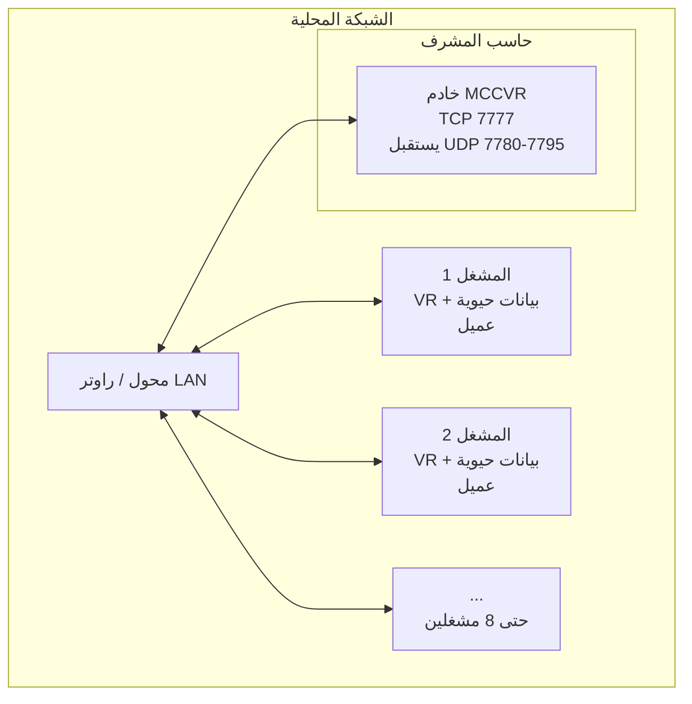

## **دليل إعداد المشرف MCC**

مركز المراقبة والتحكم (MCC)

الإصدار 1.2 | مارس 2026

## **جدول المحتويات**

1. المقدمة
2. متطلبات الأجهزة
3. المتطلبات البرمجية المسبقة
4. تهيئة الشبكة
5. التثبيت
6. تهيئة وضع المشرف
7. بدء جلسة
8. ميزات لوحة معلومات المشرف
9. مخرجات البيانات وهيكل الملفات
10. استكشاف الأخطاء
11. الملحق أ: مرجع المنافذ
12. الملحق ب: المصطلحات

## **1. المقدمة**

## **1.1 ما هو MCC؟**

MCC (مركز المراقبة والتحكم) هو محاكي تدريب بالواقع الافتراضي مبني على Unreal Engine 5.6. يتيح المراقبة الفورية لعدة مشغلي واقع افتراضي بواسطة مشرف مركزي. يلتقط النظام البيانات الحيوية وتتبع العين وبث كاميرات المراقبة وإجراءات المشغل لتحليل التدريب والمراجعة.

## **1.2 دور المشرف**

المشرف هو محطة التحكم المركزية. حاسب المشرف:

- **يستضيف جلسة اللعبة** (يعمل كخادم استماع)
- **يستقبل بث كاميرات مباشر** من جميع المشغلين المتصلين عبر بث UDP
- **يراقب البيانات الحيوية للمشغلين** (معدل ضربات القلب، مستويات الإجهاد، التوصيل الكهربائي للجلد)
- **يتتبع حركات عيون المشغلين** (التثبيتات، الرمشات السريعة، الخرائط الحرارية)
- **يتحكم بسيناريوهات التدريب** (بدء، إيقاف، تفعيل أحداث)
- **يسجل الجلسات** للإعادة والتحليل لاحقا
- **ينشئ تقارير** بتحليلات التدريب

المشرف لا يحتاج أجهزة VR - يستخدم شاشة سطح مكتب قياسية.

## **1.3 معمارية النظام**



## **الاتصالات الرئيسية:**

TCP 7777: جلسة اللعبة (شبكات Unreal Engine)

- UDP 7780+N: بث كاميرات مباشر (منفذ واحد لكل مشغل) - جميع حركة المرور تبقى على الشبكة المحلية

## **2. متطلبات الأجهزة**

## **2.1 مواصفات الحاسب الدنيا**

|**المكون**|**الحد الأدنى**|**الموصى به**|
|---|---|---|
|**نظام التشغيل**|Windows 10 64-bit|Windows 11 64-bit|
|**المعالج**|Intel i5 / AMD Ryzen 5 (6 أنوية)|Intel i7 / AMD Ryzen 7 (8+ أنوية)|
|**الذاكرة**|16 GB|32 GB|
|**بطاقة الرسومات**|NVIDIA GTX 1060 / AMD RX 580 (DX12)|NVIDIA RTX 3060 أو أفضل|
|**التخزين**|50 GB SSD|100+ GB NVMe SSD|
|**الشبكة**|منفذ Gigabit Ethernet|منفذ Gigabit Ethernet|
|**الشاشة**|شاشة 1920x1080|شاشتان أو شاشة عريضة|

## **2.2 ملاحظات مهمة**

**يجب أن تدعم بطاقة الرسومات DirectX 12** مع Shader Model 6 (SM6)

- **لا حاجة لنظارة VR** للمشرف
- **يوصى بشدة بـ Gigabit Ethernet** - WiFi غير موثوق لبث الكاميرات المباشر
  **تخزين SSD** مهم لتسجيل بيانات الجلسة (إطارات CCTV تكتب للقرص في الوقت الفعلي)

## **3. المتطلبات البرمجية المسبقة**

## **3.1 البرمجيات المطلوبة**

|**البرنامج**|**الغرض**|**التحميل**|
|---|---|---|
|**Windows 10/11** (64-bit)|نظام التشغيل|--|
|**تعريفات GPU** (الأحدث)|دعم DirectX 12 + SM6|nvidia.com أو amd.com|
|**Visual C++ Redistributables**|اعتمادية تشغيل UE5|مشمول مع البناء المجمع|

## **3.2 اختياري (البناء من المصدر فقط)**

|**البرنامج**|**الغرض**|**التحميل**|
|---|---|---|
|**Unreal Engine 5.6**|محرك اللعبة|Epic Games Launcher|
|**Visual Studio 2022**|مترجم C++|visualstudio.microsoft.com|
|**Git** + **Git LFS**|التحكم بالإصدارات|git-scm.com|

## **4. تهيئة الشبكة**

## **4.1 متطلبات LAN**

يجب أن تكون جميع الأجهزة (المشرف + جميع المشغلين) على **نفس الشبكة الفرعية المحلية**. مثال:

- المشرف: 192.168.1.100
- المشغل 1: 192.168.1.101
  المشغل 2: 192.168.1.102

وصل جميع الأجهزة بنفس الراوتر أو محول الشبكة عبر كابلات Ethernet.

## **4.2 إيجاد عنوان IP الخاص بك**

1. افتح **موجه الأوامر** (اضغط Win+R، اكتب `cmd`، اضغط Enter)
2. اكتب: `ipconfig`
3. اعثر على **عنوان IPv4** تحت محول Ethernet (مثلا `192.168.1.100`)
4. **دون هذا العنوان** - سيحتاجه المشغلون للاتصال

## **4.3 تهيئة جدار حماية Windows**

يجب أن يسمح المشرف بالاتصالات الواردة على المنافذ التالية:

## **خطوات إنشاء قواعد جدار الحماية:**

1. افتح **Windows Defender Firewall مع الأمان المتقدم** (اضغط Win، ابحث عن "firewall")
2. انقر **القواعد الواردة** في اللوحة اليسرى
3. انقر **قاعدة جديدة...** في اللوحة اليمنى

## **القاعدة 1: خادم اللعبة (TCP 7777)**

نوع القاعدة: منفذ

البروتوكول: TCP
المنافذ المحلية المحددة: 7777

- الإجراء: السماح بالاتصال
- الملف الشخصي: خاص (أو نطاق إذا على شبكة نطاق)

الاسم: "MCC Game Server"

## **القاعدة 2: تيارات الكاميرا (UDP 7780-7795)**

نوع القاعدة: منفذ
البروتوكول: UDP

المنافذ المحلية المحددة: 7780-7795

الإجراء: السماح بالاتصال

- الملف الشخصي: خاص

الاسم: "MCC Camera Streams"

_**ملاحظة:** نطاق منافذ UDP 7780-7795 يدعم حتى 16 مشغلا. كل مشغل يستخدم منفذا واحدا ابتداء من 7780._

## **4.4 التحقق من الاتصال**

بعد إعداد الشبكة، اطلب من كل مشغل التحقق من إمكانية الوصول للمشرف:

1. على حاسب المشغل، افتح موجه الأوامر
2. اكتب: `ping 192.168.1.100` (استبدل بعنوان IP للمشرف)
3. يجب أن ترى ردود ناجحة

## **5. التثبيت**

## **5.1 الخيار أ: نشر البناء المجمع (موصى به)**

1. احصل على بناء MCC المجمع من خادم البناء أو قائد الفريق
2. انسخ مجلد البناء بالكامل لحاسب المشرف (مثلا `C:\MCC\`)
3. يجب أن يبدو هيكل المجلد كالتالي:

```
C:\MCC\
├── MCC.exe                     (الملف التنفيذي الرئيسي)
├── MCC\
│   ├── Content\
│   │   ├── Configs\
│   │   │   └── Server.json     (تهيئة الدور)
│   │   └── Paks\               (محتوى اللعبة)
│   └── Binaries\
│       └── Win64\
└── Data\                        (ينشأ عند التشغيل)
    ├── Scenarios\
    ├── Replays\
    └── (مجلدات الجلسات)
```

4. شغل مثبت المتطلبات المسبقة إذا كان مشمولا (يثبت Visual C++ Redistributables)

## **5.2 الخيار ب: البناء من المصدر**

## 1. **انسخ المستودع:**

```
git lfs install
git clone <repository-url> D:\Projects\MCC
cd D:\Projects\MCC
git lfs pull
git checkout develop
```

## 2. **افتح في Unreal Engine:**

افتح Epic Games Launcher
تأكد من تثبيت UE 5.6

افتح `D:\Projects\MCC\MCC.uproject`

## 3. **جمع لـ Windows:**

File > Package Project > Windows (64-bit)
تهيئة البناء: Shipping

الخرائط للتضمين مهيأة مسبقا: EntryLobby, Lobby, ChineseEmbassy, Level_Main
انتظر اكتمال التجميع

4. انسخ مخرجات التجميع لحاسب المشرف

## **6. تهيئة وضع المشرف**

## **6.1 الطريقة أ: Server.json (افتراضي)**

ملف التهيئة الذي يحدد الدور هو:

**البناء المجمع:** `<ExeDir>\MCC\Content\Configs\Server.json`
**المحرر/المصدر:** `<ProjectDir>\Content\Configs\Server.json`

افتح `Server.json` في أي محرر نصوص (Notepad، VS Code، إلخ) واضبط:

```
{
"IP": "",
"PORT": 7777
}
```

_**مهم:** يجب أن يكون حقل `IP` **سلسلة فارغة** (`""`) لوضع المشرف. عندما يكون IP فارغا، يبدأ التطبيق كخادم استماع (مشرف). عندما يحتوي IP على عنوان صالح، يتصل كعميل (مشغل)._

## **6.2 الطريقة ب: التشغيل من سطر الأوامر مع MULTIHOME**

كبديل لتعديل Server.json، يمكنك تشغيل المشرف مباشرة من سطر الأوامر باستخدام علم `MULTIHOME`:

```
MCC.exe -MULTIHOME=192.168.1.100
```

استبدل `192.168.1.100` بـ **عنوان IP لحاسب المشرف نفسه** على LAN.

## **ما يفعله MULTIHOME:**

يخبر MCC أي عنوان IP لواجهة الشبكة يرتبط به ويبث عليه الخادم

مفيد عندما يحتوي حاسب المشرف على محولات شبكة متعددة (مثلا Ethernet + WiFi) وتحتاج تحديد أيها تستخدم

يتجاوز السلوك الافتراضي للارتباط بجميع الواجهات

## **متى تستخدم MULTIHOME:**

عندما يحتوي حاسب المشرف على واجهات شبكة متعددة ويواجه المشغلون صعوبة في اكتشاف أو الاتصال بالجلسة

عندما تريد بدء خادم بسرعة بدون تعديل Server.json
عند كتابة نص أو أتمتة عملية التشغيل

## **مثال (ملف دفعي للتشغيل السريع):**

```
@echo off
MCC.exe -MULTIHOME=192.168.1.100
```

_**ملاحظة:** عند استخدام MULTIHOME، يجب أن يبقى حقل IP في Server.json فارغا (أو يمكن أن يكون الملف غائبا). يتحكم MULTIHOME بأي واجهة يرتبط بها الخادم، وليس الدور - لا يزال الدور يحدد بواسطة Server.json._

## **6.3 تهيئة المنفذ**

المنفذ الافتراضي هو **7777**. غيره فقط إذا كان تطبيق آخر يستخدم المنفذ 7777. إذا غيرته، يجب أن يستخدم جميع المشغلين نفس المنفذ في Server.json الخاص بهم.

## **7. بدء جلسة**

## **الإجراء خطوة بخطوة**

1. **تحقق من الشبكة** - تأكد من اتصال حاسب المشرف بـ LAN ومعرفتك لعنوان IP
2. **تحقق من جدار الحماية** - تأكد من نشاط قواعد جدار الحماية لـ TCP 7777 و UDP 7780-7795
3. **تحقق من Server.json** - تأكد من أن IP فارغ و PORT مضبوط
4. **شغل MCC** - إما:
   انقر مرتين على ملف MCC التنفيذي (يستخدم Server.json)، أو
   شغل من سطر الأوامر: `MCC.exe -MULTIHOME=<your_IP>` للارتباط بواجهة محددة
5. **ردهة الدخول** - يحمل التطبيق ردهة الدخول تلقائيا
6. **إنشاء خادم الاستماع** - يقرأ التطبيق Server.json، يجد IP فارغ، وينشئ خادم استماع على المنفذ 7777
7. **انتظار المشغلين** - يتصل المشغلون من أجهزتهم. سترى ظهورهم في الردهة
8. **اختيار السيناريو** - اختر سيناريو التدريب من واجهة الردهة
9. **بدء الجلسة** - بمجرد انضمام جميع المشغلين المتوقعين، اضغط بدء لبدء جلسة التدريب
10. **الانتقال لمستوى التدريب** - جميع اللاعبين المتصلين ينتقلون لخريطة التدريب (مثلا ChineseEmbassy أو Level_Main)

_**ملاحظة:** الحد الأقصى للاعبين المتصلين هو 16. مهلة الاتصال 60 ثانية - إذا لم يكتمل اتصال مشغل خلال 60 ثانية، تفشل محاولة الاتصال._

## **8. ميزات لوحة معلومات المشرف**

بمجرد نشاط جلسة التدريب، يمكن للمشرف الوصول إلى:

## **8.1 بث كاميرات مباشر**

تيارات كاميرات المراقبة في الوقت الفعلي من كل مشغل

- تستقبل عبر بث UDP (مضغوطة JPEG، جودة 70) - التبديل بين المشغلين وزوايا الكاميرا - تدعم حتى 8 كاميرات لكل مشغل

## **8.2 مراقبة البيانات الحيوية**

**معدل ضربات القلب** - نبضات حية من مستشعر EmotiBit

- **التوصيل الكهربائي للجلد (EDA)** - مستويات النشاط الكهربائي للجلد
- **كشف إجهاد SCR** - كشف آلي لأحداث الإجهاد باستخدام: سعة SCR (قائم على العتبة)
   - وقت صعود SCR
   - تردد SCR
   - تحليل Z-score مع نافذة أساسية 5 دقائق

## **8.3 بيانات تتبع العين والتثبيت**

- تصور نقطة النظر (علامات ثلاثية الأبعاد في المشهد) - أحداث التثبيت مع المدة والتردد - أهداف التثبيت: الشاشات، الجدران المباشرة، الشخصيات، العناصر - كشف الرمشات السريعة (عتبة 3 درجات)

## **8.4 تصور الخريطة الحرارية**

خرائط حرارية مكانية للانتباه على شاشات المراقبة

تظهر أين يركز المشغلون انتباههم بمرور الوقت
قابلة للتهيئة في DefaultGame.ini (مفعلة افتراضيا)

## **8.5 نظام شاشات المراقبة**

واجهة شاشة مراقبة تفاعلية

أدوات التحكم بالكاميرا PTZ (تحريك، إمالة، تقريب)
عرض شبكة شاشات متعددة (الجدار المباشر)

## **8.6 نظام إنذارات الطوارئ**

تفعيل الإنذارات وأحداث المشتتات للمشغلين
تسجيل استجابات الطوارئ

## **8.7 تسجيل الإجراءات**

جميع إجراءات المشغلين تسجل بطوابع زمنية
تشمل: تعديلات الكاميرا، أحداث التثبيت، التفاعلات
تخزن كملفات JSON لتحليل ما بعد الجلسة

## **8.8 نظام الإعادة**

تسجل الجلسات باستخدام DemoNetDriver في Unreal Engine
مراجعة جلسة أي مشغل بعد انتهاء التدريب
أدوات تحكم بالخط الزمني، تبديل المشغلين، تشغيل متزامن

## **8.9 إنشاء التقارير**

تصدير تقارير التدريب كـ PDF عبر إضافة ReportExport
تشمل التحليلات وبيانات التثبيت وملخصات البيانات الحيوية

## **9. مخرجات البيانات وهيكل الملفات**

تحفظ جميع بيانات الجلسة تحت دليل `Data/` بالنسبة للملف التنفيذي.

```
Data/
├── Scenarios/                          # سيناريوهات التدريب المعرفة مسبقا
│   ├── Embassy.json
│   ├── EtihadParkConcert.json
│   ├── Protest.json
│   └── ShoppingMall.json
│
├── Replays/                            # ملفات إعادة الجلسة (.replay)
│
└── 2026-03-25_14-30-00/                # مجلد طابع وقت الجلسة
    └── Supervisor/
        ├── Logs/
        │   └── Analytics/              # تحليلات جانب المشرف
        ├── Reports/                    # تقارير PDF المنشأة
        ├── EmergencyAlarms/            # سجلات أحداث الإنذار
        │
        ├── Operator_John/             # بيانات لكل مشغل
        │   ├── CCTVRecordings/        # إطارات الكاميرا المبثوثة
        │   ├── Biometrics/            # بيانات مستشعر EmotiBit
        │   ├── FrameMarks/
        │   │   └── Camera_0/         # تعليقات الإطارات
        │   └── Logs/
        │       └── Analytics/         # سجلات إجراءات المشغل
        │
        └── Operator_Jane/            # مشغل آخر
            └── (نفس الهيكل)
```

_**ملاحظة التخزين:** تسجيلات المراقبة قد تستهلك مساحة قرص كبيرة. بجودة JPEG 70، توقع حوالي 50-100 MB لكل كاميرا لكل جلسة 10 دقائق. خطط للتخزين وفقا لذلك._

## **10. استكشاف الأخطاء**

## **10.1 المشغلون لا يستطيعون الاتصال**

|**تحقق من**|**الحل**|
|---|---|
|نفس الشبكة؟|تحقق من أن جميع الحواسب على نفس الشبكة الفرعية LAN|
|جدار الحماية؟|تأكد من السماح بـ TCP 7777 واردة على المشرف|
|Server.json؟|يجب أن يكون IP فارغ عند المشرف؛ يجب أن يحتوي على IP المشرف عند المشغل|
|تعارض المنفذ؟|تحقق من أن المنفذ 7777 ليس مستخدما من تطبيق آخر|
|اختبار الاتصال؟|يجب أن يتمكن المشغل من اختبار اتصال IP المشرف|
|واجهات شبكة متعددة؟|إذا كان للمشرف محولات شبكة متعددة، استخدم `-MULTIHOME=<IP>` للارتباط بالواجهة الصحيحة|

## **10.2 لا بث كاميرات من المشغلين**

|**تحقق من**|**الحل**|
|---|---|
|منافذ UDP؟|تأكد من فتح UDP 7780-7795 واردة على المشرف|
|عرض النطاق؟|استخدم Gigabit Ethernet؛ WiFi قد يكون غير كاف|
|المشغل يعمل؟|تحقق من اتصال المشغل ووجوده في جلسة التدريب|

## **10.3 لا بيانات حيوية مرئية**

|**تحقق من**|**الحل**|
|---|---|
|EmotiBit على المشغل؟|تحقق من اتصال EmotiBit وبثه على حاسب المشغل|
|المشغل متصل؟|البيانات الحيوية تحول عبر RPCs اللعبة - يجب أن يكون المشغل في الجلسة|
|لوحة المعلومات مفتوحة؟|تأكد من ظهور لوحات البيانات الحيوية على لوحة معلومات المشرف|

## **10.4 التطبيق ينهار عند التشغيل**

|**تحقق من**|**الحل**|
|---|---|
|تعريفات GPU؟|حدث لأحدث التعريفات الداعمة لـ DX12|
|DirectX 12؟|تحقق من دعم GPU لـ DX12 مع Shader Model 6|
|VC++ Redist؟|ثبت Visual C++ Redistributable 2022|
|مساحة القرص؟|تأكد من كفاية مساحة القرص الحرة لمجلد Data/|

## **10.5 بيانات الجلسة لا تحفظ**

|**تحقق من**|**الحل**|
|---|---|
|صلاحيات الكتابة؟|تأكد من إمكانية الكتابة لمجلد Data/|
|مساحة القرص؟|تحقق من كفاية المساحة الحرة|
|مضاد الفيروسات؟|بعض مضادات الفيروسات قد تمنع إنشاء الملفات السريع؛ أضف MCC للاستثناءات|

## **الملحق أ: مرجع المنافذ**

|**المنفذ**|**البروتوكول**|**الاتجاه**|**الغرض**|
|---|---|---|---|
|**7777**|TCP|وارد|خادم لعبة Unreal Engine (خادم استماع)|
|**7780**|UDP|وارد|تيار كاميرا - المشغل 1|
|**7781**|UDP|وارد|تيار كاميرا - المشغل 2|
|**7782**|UDP|وارد|تيار كاميرا - المشغل 3|
|**...**|UDP|وارد|تيار كاميرا - مشغلون إضافيون|
|**7795**|UDP|وارد|تيار كاميرا - المشغل 16 (الحد الأقصى)|

_كل مشغل يخصص له منفذ UDP واحد بناء على معرف اللاعب: المنفذ = 7780 + PlayerID_

## **الملحق ب: المصطلحات**

|**المصطلح**|**التعريف**|
|---|---|
|**MCC**|مركز المراقبة والتحكم|
|**CCTV**|تلفزيون الدائرة المغلقة - نظام كاميرات أمنية داخل اللعبة|
|**EDA**|النشاط الكهربائي للجلد - قياس التوصيل الكهربائي للجلد|
|**SCR**|استجابة التوصيل الكهربائي للجلد - تغير سريع في EDA يشير للإثارة|
|**EmotiBit**|جهاز مستشعر حيوي قابل للارتداء|
|**التثبيت**|فترة تبقى فيها العين ثابتة نسبيا على هدف|
|**الرمشة السريعة**|حركة عين سريعة بين نقاط التثبيت|
|**الخريطة الحرارية**|تمثيل مرئي لتوزيع الانتباه|
|**DemoNetDriver**|نظام تسجيل الإعادة المدمج في Unreal Engine|
|**خادم الاستماع**|خادم لعبة يعمل أيضا كلاعب (المشرف يستضيف ويلعب)|
|**MULTIHOME**|علم سطر أوامر UE يربط الخادم بعنوان IP واجهة شبكة محددة|
|**OpenXR**|معيار بيئة تشغيل VR/AR عبر المنصات|
|**PTZ**|تحريك-إمالة-تقريب - طريقة التحكم بالكاميرا|
|**Server.json**|ملف تهيئة يحدد دور المشرف مقابل المشغل|
|**UDP**|بروتوكول بيانات المستخدم - يستخدم لبث الكاميرات بتأخير منخفض|
|**SM6**|Shader Model 6 - متطلب قدرة GPU|
|**Vive Focus Vision**|نظارة VR مستقلة من HTC مع بث من الحاسب، يستخدمها المشغلون|

دليل إعداد المشرف MCC الإصدار 1.2
