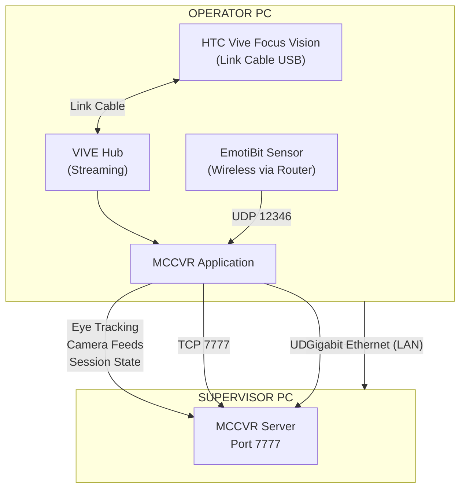

## **MCC Operator Setup Guide** 

Monitoring and Control Center (MCC) 

Version 1.2 | March 2026 

## **Table of Contents** 

1. Introduction 

2. Hardware Requirements 

3. Software Prerequisites 

4. HTC Vive Focus Vision Setup 

5. EmotiBit Sensor Setup 

6. Network Configuration 

7. Configuring Operator Mode 

8. Joining a Session 

9. During a Training Session 

10. Data Output and File Structure 

11. Troubleshooting 

12. Appendix A: Port Reference 

13. Appendix B: EmotiBit Sensor Tags 

14. Appendix C: Glossary 

## **1. Introduction** 

## **1.1 What is MCC?** 

MCC (Monitoring and Control Center) is a VR-based training simulator built on Unreal Engine 5.6. It enables real-time monitoring of multiple VR operators by a central supervisor. The system captures biometric data, eye tracking, CCTV camera feeds, and operator actions for training analysis. 

## **1.2 The Operator Role** 

The Operator is the trainee immersed in the VR environment. The Operator computer: 

- **Connects to the Supervisor's session** as a network client 

- **Runs the VR training scenario** streamed to an HTC Vive Focus Vision headset 

- **Captures eye tracking data** via the headset's built-in eye tracking and OpenXR 

- **Collects biometric data** from an EmotiBit wearable sensor (heart rate, skin conductance, temperature, etc.) **Streams live camera feeds** to the Supervisor via UDP 

**Records all actions and interactions** for post-session analysis 

## **1.3 System Architecture** 



## **2. Hardware Requirements** 

## **2.1 VR-Capable PC** 

|**Component**|**Minimum**|**Recommended**|
|---|---|---|
|**OS**|Windows 10 64-bit|Windows 11 64-bit|
|**CPU**|Intel i7 / AMD Ryzen 7 (6+ cores)|Intel i9 / AMD Ryzen 9 (8+ cores)|
|**RAM**|16 GB|32 GB|
|**GPU**|NVIDIA RTX 2060 8GB (DX12, SM6)|NVIDIA RTX 3070 or better|
|**Storage**|100 GB SSD|256+ GB NVMe SSD|
|**Network**|Gigabit Ethernet port|Gigabit Ethernet port|
|**WiFi**|WiFi 5 (for VR streaming + EmotiBit)|WiFi 6/6E router (for low-latency VR streaming)|


_**GPU must support DirectX 12 with Shader Model 6 (SM6).** NVIDIA RTX series cards are recommended. GPU drivers must be up to date._ 

## **2.2 HTC Vive Focus Vision** 

|**Component**|**Details**|
|---|---|
|**Headset**|HTC Vive Focus Vision (standalone with PC VR streaming)|
|**Tracking**|Inside-out (4 built-in cameras -- no base stations required)|
|**Eye Tracking**|Built-in (2 eye-tracking cameras with auto-IPD)|
|**PC Connection**|WiFi 6/6E streaming via VIVE Hub (recommended)|
|**Alt PC Connection**|Optional VIVE Wired Streaming Kit (USB-C with DP 1.4 Alt Mode)|
|**Controllers**|2x Vive Focus controllers (optional, depends on scenario)|
|**Charging**|USB-C charging cable (included)|


_**No base stations are needed.** The Vive Focus Vision uses inside-out tracking with 4 onboard cameras. This simplifies setup significantly compared to earlier Vive headsets._ 

## **2.3 EmotiBit Sensor** 

|**Component**|**Details**|
|---|---|
|**Device**|EmotiBit MD (or compatible model with WiFi)|
|**Included**|Sensor board, electrode connector, wrist/arm strap, microSD card|
|**WiFi**|Built-in WiFi shield (2.4 GHz only)|
|**Battery**|Built-in rechargeable battery (USB-C charging)|


**Placement** Inner forearm (recommended for optimal EDA readings) 

## **2.4 Network Infrastructure** 

**Ethernet cable** -- Connects Operator PC to the LAN switch/router 

**WiFi router** -- Must support WiFi 5 or WiFi 6/6E. The Vive Focus Vision streams PC VR via WiFi. EmotiBit also connects via WiFi (2.4 GHz). Both the headset and EmotiBit must be on the same network as the Operator PC. 

**LAN switch/router** -- Connecting all machines together 

_**Tip:** For best VR streaming performance, connect the Operator PC to the router via Ethernet and ensure clear line of sight between the WiFi router and the Vive Focus Vision headset._ 

## **3. Software Prerequisites** 

## **3.1 Required Software** 

|**Software**|**Version**|**Purpose**|**Download Source**|
|---|---|---|---|
|**Windows 10/11**|64-bit|Operating system|--|
|**GPU Drivers**|Latest|DX12 + SM6 support|nvidia.com / amd.com|
|**Steam**|Latest|Platform for SteamVR|store.steampowered.com|
|**SteamVR**|Latest<br>stable|VR runtime + OpenXR|Via Steam Store (free)|
|**VIVE Hub**|Latest|PC VR streaming to Vive<br>Focus Vision|vive.com|
|**EmotiBit**<br>**Oscilloscope**|Latest|EmotiBit configuration +<br>streaming|github.com/EmotiBit/ofxEmotiBit/releases|
|**Visual C++ Redist**|2022|UE5 runtime dependency|Included with build|


## **3.2 Installation Order** 

Install software in this order to avoid dependency issues: 

1. GPU Drivers (reboot after install) 

2. Steam 

3. SteamVR (install via Steam) 

4. VIVE Hub 

5. EmotiBit Oscilloscope 

6. MCC Application 

## **4. HTC Vive Focus Vision Setup** 

## **4.1 Headset Initial Setup** 

1. **Charge the headset** fully using the included USB-C cable before first use 

2. **Power on the headset** by pressing and holding the power button 

3. **Complete the on-headset setup wizard:** 

   - Select language 

   - Connect to WiFi (use the same WiFi network as the Operator PC) 

   - Sign in with your HTC/VIVE account (or create one) 

   - Accept terms and conditions 

   - Complete the initial firmware update if prompted 

## **4.2 Play Area / Boundary Setup** 

The Vive Focus Vision uses **inside-out tracking** -- it tracks your position using 4 cameras on the headset. No external base stations are needed. 

**Setting up your play area:** 

1. **Put on the headset** -- it will prompt you to set up a boundary when needed 

2. **Confirm the floor level** -- look at the ground and confirm the detected floor height 

3. **Choose play area type:** 

**Stationary** -- For seated or standing-in-place scenarios (smaller space) 

**Room-Scale** -- For walking around (minimum 1.5m x 1.5m recommended) 

4. **Draw your boundary** (Room-Scale): 

Point the controller at the ground 

Press and hold the trigger at your starting point 

Walk around the perimeter of your play area while holding the trigger Release when you return to the starting point 

5. **Confirm the boundary** -- the system will show a preview 

## **Tracking optimization tips:** 

Ensure the room has adequate lighting (bright enough to read a book) 

Avoid direct intense light or glare on the headset cameras 

- Use rooms with visual patterns on walls, floor, and ceiling (featureless white walls reduce tracking quality) Keep the play area clear of obstacles 

You can set up to 3 different saved play areas 

## **4.3 Install VIVE Hub on PC** 

VIVE Hub is the software that enables PC VR streaming from the Operator PC to the Vive Focus Vision headset. 

1. **Download VIVE Hub** from vive.com 

2. **Install and launch** VIVE Hub on the Operator PC 

3. **Sign in** with the same HTC/VIVE account used on the headset 

## **4.4 Connect Headset to PC (Wireless Streaming)** 

This is the **recommended connection method** for MCC: 

1. **Ensure the Operator PC is connected via Ethernet** to the same router that provides WiFi to the headset 

2. **Launch VIVE Hub** on the Operator PC 

3. **On the headset** , open the VIVE streaming app (in the headset's app library) 

4. **The headset will discover the PC** running VIVE Hub on the same network 

5. **Select your PC** from the list and click Connect 

6. **The PC VR environment loads** -- you are now streaming PC VR to the headset 

7. **SteamVR launches automatically** on the PC as part of the streaming session 

## _**WiFi Requirements for best streaming quality:**_ 

_WiFi 6 (802.11ax) or WiFi 6E router recommended_ 

- _PC connected to router via Ethernet (not WiFi)_ 

- _5 GHz WiFi band for the headset (2.4 GHz is too slow for VR streaming)_ 

- _Clear line of sight between headset and router Minimize other devices on the same WiFi band_ 

## **4.5 Alternative: Wired Streaming (Optional)** 

If WiFi streaming quality is insufficient, you can use the optional **VIVE Wired Streaming Kit** : 

1. **Purchase the VIVE Wired Streaming Kit** separately from HTC 

2. **Connect the USB-C cable** from the streaming kit to the headset and to the PC 

3. **The PC must support USB 3.2 Gen 2 with DisplayPort 1.4 Alternate Mode** on the USB-C port 

4. **Launch VIVE Hub** -- it will detect the wired connection automatically 

5. **Select wired streaming** when prompted 

_**When to use wired:** Graphics-intensive scenarios, environments with WiFi interference, or when absolute minimum latency is required._ 

## **4.6 Set SteamVR as Active OpenXR Runtime** 

This is critical for MCC to work correctly: 

1. Open **SteamVR Settings** (gear icon in SteamVR window) 

2. Navigate to **Developer** tab 

3. Click **"Set SteamVR as OpenXR Runtime"** 

4. Verify the message confirms SteamVR is the active OpenXR runtime 

_**Why this matters:** MCC uses OpenXR as the VR interface. If another runtime is set as default, the application may not function correctly._ 

## **4.7 Eye Tracking Setup** 

The Vive Focus Vision has **built-in eye tracking** with 2 dedicated eye-tracking cameras. This enables MCC to capture gaze data, fixations, and saccades. 

## **Calibrating eye tracking:** 

1. **On the headset** , go to Settings > Eye Tracking 

2. **Run the eye tracking calibration** -- follow the on-screen dots with your eyes 

3. **Calibration completes** in about 15 seconds 

4. **Recalibrate** if you: 

Adjust the headset position significantly Change the IPD (interpupillary distance) setting Notice eye tracking seems inaccurate 

_**Auto-IPD:** The Vive Focus Vision uses eye tracking to automatically measure and set your IPD for optimal visual clarity._ 

## **MCC eye tracking parameters (pre-configured):** 

Gaze confidence minimum: 0.6 (lower confidence data is discarded) 

Saccade detection threshold: 3.0 degrees Gaze smoothing: dual-alpha (slow: 0.15, fast: 0.6) Fixation threshold: 0.5 seconds 

These are defined in `DefaultOpenXR.ini` and require no manual changes. 

## **5. EmotiBit Sensor Setup** 

## **5.1 What is EmotiBit?** 

EmotiBit is a wearable open-source biometric sensor that captures multiple physiological signals. MCC uses EmotiBit to monitor operator stress, arousal, and physiological state during training. 

## **Data collected by MCC from EmotiBit:** 

|**Metric**|**Tag**|**Description**|
|---|---|---|
|Heart Rate|HR|Beats per minute|
|Inter-Beat Interval|BI|Time between heartbeats (ms)|
|EDA Value|EA|Electrodermal activity (skin conductance)|
|EDA Level|EL|Tonic skin conductance level|
|Temperature|T1|Skin temperature|
|SCR Amplitude|SA|Skin conductance response magnitude|
|SCR Frequency|SF|Rate of skin conductance responses|
|SCR Rise Time|SR|Time to peak of SCR event|
|PPG Infrared|PI|Photoplethysmography (infrared)|
|PPG Red|PR|Photoplethysmography (red)|
|PPG Green|PG|Photoplethysmography (green)|
|Accelerometer|AX, AY, AZ|Motion (3-axis)|
|Gyroscope|GX, GY, GZ|Rotation (3-axis)|
|Magnetometer|MX, MY, MZ|Magnetic field (3-axis)|
|Battery|BInfo|Battery status|
|Status|ES|Device status|


## **5.2 Hardware Assembly** 

1. **Charge the EmotiBit** fully before use (USB-C charging) 

2. **Attach the EmotiBit** to the included arm/wrist strap 

3. **Connect electrode leads** (if using EDA electrodes) 

4. **Strap placement:** Inner forearm, approximately 5 cm above the wrist Ensure good skin contact for EDA readings The sensor should be snug but not tight 

5. **Power on the EmotiBit** (press the button on the board) 

## **5.3 First-Time WiFi Configuration** 

EmotiBit uses an SD-card-based WiFi configuration. You must edit a config file on the microSD card before the sensor can connect to your WiFi network. 

_**IMPORTANT:** EmotiBit only supports the_ _**2.4 GHz WiFi band** . It will not connect to 5 GHz networks. Ensure your router or access point has 2.4 GHz enabled._ 

## **Step-by-step procedure:** 

1. **Download the config file template** from https://www.emotibit.com/files/config -- this downloads a file named `config.txt` 

2. **Open** **`config.txt` in a text editor** (Notepad on Windows). The file contains: 

```
{
```

```
"WifiCredentials": [
```

```
    {"ssid": "myWifiNetwork", "password": "myPassword"}
  ]
}
```

## 3. **Edit the WiFi credentials:** 

Replace `myWifiNetwork` with your actual WiFi network name (SSID) 

Replace `myPassword` with your actual WiFi password 

Do NOT change the JSON formatting (keep all quotes, brackets, and braces exactly as shown) Example for a network named "LabWiFi" with password "Training2026": 

```
{
"WifiCredentials": [
    {"ssid": "LabWiFi", "password": "Training2026"}
  ]
}
```

## 4. **Optional: Add multiple networks** (EmotiBit auto-connects to whichever is in range): 

```
{
"WifiCredentials": [
    {"ssid": "LabWiFi", "password": "Training2026"},
    {"ssid": "OfficeWiFi", "password": "Office1234"}
  ]
}
```

## 5. **Remove the microSD card** from the EmotiBit 

6. **Insert the microSD card** into a USB card reader connected to your computer 

7. **Copy the edited** **`config.txt`** to the **root directory** of the microSD card (not inside any subfolder) 

_**WARNING: Double file extensions.** Windows may hide file extensions, causing the file to be saved as_ _`config.txt.txt` . To avoid this:_ 

_Open File Explorer > View > check "File name extensions" Verify the file is named exactly_ _`config.txt` , not_ _`config.txt.txt`_ 

_**WARNING: Renamed downloads.** Your browser may save the file as_ _`config(1).txt` . Rename it to exactly_ _`config.txt` before copying to the SD card._ 

8. **Safely eject the SD card** from the computer 

9. **Insert the microSD card back** into the EmotiBit 

10. **Press the reset button** on top of the Adafruit Feather board on the EmotiBit 

11. **Wait 5-10 seconds** for boot-up. If the credentials are correct and the WiFi network is in range, the EmotiBit connects automatically 

## 12. **Verify connection using LED indicators:** 

|**LED**|**Color**|**Meaning**|
|---|---|---|
|WiFi LED|**Green (constant)**|Successfully connected to WiFi|
|Oscilloscope LED|**Blue**|Connected to EmotiBit Oscilloscope|
|Recording LED|**Red (blinking)**|Recording session active|


If the green WiFi LED does not light up after 10 seconds, double-check: 

The `config.txt` file is correctly formatted (valid JSON) 

- The SSID and password are correct 

The WiFi network is 2.4 GHz (not 5 GHz only) 

- The EmotiBit is within WiFi range 

## **5.4 EmotiBit Oscilloscope Setup** 

The EmotiBit Oscilloscope is the companion desktop application for connecting to, visualizing, and streaming EmotiBit data. 

## **Installation:** 

1. Download the latest release from https://github.com/EmotiBit/ofxEmotiBit/releases 

2. On Windows, run the `.msi` installer 

3. Launch **EmotiBit Oscilloscope** 

## **Connecting to the EmotiBit:** 

1. Ensure the EmotiBit is powered on and connected to WiFi (green LED on) 

2. Open EmotiBit Oscilloscope 

3. The application will discover the EmotiBit on the network automatically 

4. Select your EmotiBit from the device list 

5. Click **Connect** -- the blue LED on the EmotiBit should light up 

6. You should now see live sensor graphs (heart rate, EDA, temperature, etc.) 

- _**Firewall note:** When first launching EmotiBit Oscilloscope, Windows may prompt you to allow network access. Click "Allow" -- this is required for the application to communicate with the EmotiBit._ 

## **5.5 Configure UDP Streaming to MCC** 

MCC receives EmotiBit data on **UDP port 12346** . Configure EmotiBit Oscilloscope to stream data: 

1. In EmotiBit Oscilloscope, navigate to **Output / Streaming settings** 

## 2. **Enable UDP output streaming** 

3. **Set the target:** 

**IP Address:** `127.0.0.1` (localhost -- since MCC and Oscilloscope run on the same PC) **Port:** `12346` 

4. **Enable all sensor streams** (HR, EDA, Temperature, PPG, Accelerometer, Gyroscope, Magnetometer, SCR) 

## 5. **Start streaming** 

## **5.6 Verifying EmotiBit Data Reception** 

Before starting MCC, verify that EmotiBit data is being transmitted correctly: 

- With the sensor connected, you should see **live graphs** in the EmotiBit Oscilloscope window for heart rate, EDA, temperature, and other metrics 

- Once MCC is running and connected to a session, the Supervisor dashboard will show biometric data panels If the Supervisor sees biometric data for your operator, the full pipeline is working 

## **6. Network Configuration** 

## **6.1 Connect to the Same LAN as Supervisor** 

1. **Connect an Ethernet cable** from the Operator PC to the same LAN switch/router as the Supervisor 

2. **Verify IP address** is in the same subnet as the Supervisor Open Command Prompt: `ipconfig` 

Example: If Supervisor is 192.168.1.100, Operator should be 192.168.1.xxx 

## **6.2 Obtain the Supervisor's IP Address** 

Ask the person running the Supervisor to provide their IP address. This is needed for Step 7 (configuring Server.json). 

## **6.3 Windows Firewall Configuration** 

## **Create the following firewall rule on the Operator PC:** 

## **Rule 1: EmotiBit Data (UDP 12346 Inbound)** 

1. Open Windows Defender Firewall with Advanced Security 

2. Inbound Rules > New Rule 

3. Port > UDP > Specific local port: `12346` 

4. Allow the connection > Private 

5. Name: "MCC EmotiBit Data" 

**Outbound connections** (TCP 7777 game traffic, UDP 7780+ camera streams) are typically allowed by default on Windows. If you have a restrictive firewall, also allow outbound TCP 7777 and outbound UDP 7780-7795. 

## **6.4 Verify Connectivity** 

1. Open Command Prompt on the Operator PC 

2. Ping the Supervisor: `ping 192.168.1.100` (replace with actual Supervisor IP) 

3. You should see successful replies with low latency (under 5ms on LAN) 

## **7. Configuring Operator Mode** 

## **7.1 Locate Server.json** 

**Packaged build:** `<ExeDir>\MCC\Content\Configs\Server.json` **Editor/Source:** `<ProjectDir>\Content\Configs\Server.json` 

## **7.2 Set Operator Mode** 

Open `Server.json` in a text editor and set the Supervisor's IP address: 

```
{
"IP": "192.168.1.100",
"PORT": 7777
}
```

_**IMPORTANT:** Replace_ _`192.168.1.100` with the actual IP address of the Supervisor PC. The_ _`PORT` must match what the Supervisor has configured (default: 7777)._ 

_**How it works:** When the IP field contains a valid address, MCC starts as an Operator (client) and connects to that address. When the IP is empty, MCC starts as a Supervisor (server)._ 

## **7.3 Note on Supervisor's MULTIHOME Flag** 

The Supervisor may be started with a command-line flag: `MCC.exe -MULTIHOME=192.168.1.100` . This controls which network interface the Supervisor binds to. **This does not affect how Operators connect** -- you still use the Supervisor's IP address in your Server.json as described above. 

## **8. Joining a Session** 

## **Pre-Flight Checklist** 

Before launching MCC, verify all of the following: 

Vive Focus Vision is charged, powered on, and connected to WiFi 

VIVE Hub is running on the Operator PC and streaming to the headset 

- SteamVR is running (launched automatically by VIVE Hub streaming) 

- SteamVR is set as the active OpenXR runtime 

- Eye tracking is calibrated on the headset 

- EmotiBit is powered on and connected via WiFi (green LED) 

- EmotiBit Oscilloscope is connected and streaming to UDP port 12346 

- Server.json has the Supervisor's IP address and correct port 

- You can ping the Supervisor PC successfully 

- Windows Firewall allows UDP 12346 inbound 

## **Step-by-Step Procedure** 

1. **Power on the Vive Focus Vision** and put it on 

2. **Start VIVE Hub streaming** -- connect the headset to the Operator PC 

3. **SteamVR launches** automatically as part of the streaming session 

4. **Start EmotiBit Oscilloscope** -- Verify live sensor data is visible, UDP streaming is active 

5. **Launch MCC** -- Double-click the MCC executable 

6. **VR Mode Activates** -- The application starts in VR automatically 

7. **Entry Lobby Loads** -- The application reads Server.json, finds the Supervisor IP 

8. **Session Discovery** -- MCC searches for the Supervisor's LAN session 

9. **Connect to Supervisor** -- MCC joins the session on port 7777 

10. **Lobby Screen** -- You appear in the lobby. Enter your operator name when prompted 

11. **Wait for Session Start** -- The Supervisor controls when the training session begins 

12. **Training Begins** -- All players travel to the training map 

_**Connection timeout:** If the connection to the Supervisor fails within 60 seconds, verify your network configuration and try again._ 

## **9. During a Training Session** 

Once a training session is active, the following systems operate automatically: 

## **9.1 Eye Tracking** 

- Your gaze direction is continuously captured via the Vive Focus Vision's built-in eye tracking and OpenXR Fixation events (when you look at something for more than 0.5 seconds) are recorded Saccades (rapid eye movements) are detected at a 3-degree threshold All data is sent to the Supervisor in real-time 

## **9.2 Camera Feed Streaming** 

CCTV camera views from your perspective are streamed to the Supervisor 

- Streaming uses UDP on port 7780 + your operator index 

- Frames are JPEG compressed (quality 70) and fragmented into 1400-byte packets Up to 8 cameras can be streamed simultaneously 

This is fully automatic -- no action required 

## **9.3 Biometric Data** 

EmotiBit data (heart rate, EDA, temperature, SCR, etc.) is received on UDP port 12346 Data is processed locally and forwarded to the Supervisor via game RPCs Stress detection runs automatically using SCR analysis (Z-score based, 5-minute baseline) 

## **9.4 Action Logging** 

All your interactions are logged with timestamps: 

Camera adjustments (zoom, pan, tilt) 

Monitor interactions 

Fixation events 

- UI actions 

Logs are stored as JSON files 

## **9.5 Session Recording** 

The session is recorded by the Supervisor for replay 

Your actions and state are captured via Unreal Engine's replay system 

## **10. Data Output and File Structure** 

Operator-side session data is saved under the `Data/` directory: 

```
Data/
└── 2026-03-25_14-30-00/            # Session timestamp
    └── John_Smith/                  # Your operator name
        ├── CCTVRecordings/          # Local CCTV camera frames
        ├── Reports/                 # Generated reports
        ├── EmergencyAlarms/         # Alarm event logs
        ├── Biometrics/              # EmotiBit sensor data
        └── Logs/
            └── Analytics/           # Action logs (JSON)
```

_**Note:** The primary data repository is on the Supervisor machine. The Operator machine stores a local copy of some data for redundancy._ 

## **11. Troubleshooting** 

## **11.1 Cannot Connect to Supervisor** 

|**Check**|**Solution**|
|---|---|
|Server.json correct?|Verify IP matches Supervisor's actual IP; PORT matches|
|Supervisor running?|The Supervisor must launch MCC and create a session first|
|Same network?|Both PCs must be on the same LAN subnet|
|Ping test?|Run`ping <supervisor_ip>`-- should succeed|
|Firewall?|Supervisor must allow TCP 7777 inbound|
|Timeout?|Connection has 60-second timeout; if slow, check network|


## **11.2 VR Headset Not Streaming / Not Detected** 

|**Check**|**Solution**|
|---|---|
|VIVE Hub running?|VIVE Hub must be running on the PC before launching MCC|
|Same WiFi network?|Headset and PC must be on the same network|
|WiFi band?|Use 5 GHz WiFi for the headset (2.4 GHz is too slow for VR streaming)|
|Ethernet on PC?|PC should be connected to the router via Ethernet for best performance|
|WiFi interference?|Minimize other devices on the same WiFi band; ensure clear line of sight to router|
|Headset charged?|Ensure the headset has adequate battery|
|SteamVR launching?|SteamVR should launch automatically when VIVE Hub streaming starts|
|Wired alternative?|If WiFi is unreliable, use the optional VIVE Wired Streaming Kit|


## **11.3 Eye Tracking Not Working** 

|**11.3 Eye Tracking**|**Not Working**|
|---|---|
|**Check**|**Solution**|
|OpenXR<br>runtime?|SteamVR must be set as active OpenXR runtime|
|Calibrated?|Run eye tracking calibration in headset Settings > Eye Tracking|
|Headset fit?|Ensure the headset is properly seated on your head; eyes centered in lenses|
|Recalibrate?|If headset was adjusted, re-run calibration|
|Fallback mode?|If hardware eye tracking is unavailable, MCC uses simulated eye tracking (camera forward<br>direction)|


## **11.4 EmotiBit Data Not Appearing** 

|**Check**|**Solution**|
|---|---|
|EmotiBit powered on?|LED should be active on the sensor board|
|Green WiFi LED?|Must show constant green -- if not, check config.txt on SD card|
|WiFi band?|EmotiBit only supports 2.4 GHz -- not 5 GHz|
|config.txt valid?|Verify JSON format is correct, no double file extension|
|Same network?|EmotiBit and PC must be on the same WiFi network|
|Oscilloscope connected?|Blue LED on EmotiBit should be lit|
|UDP streaming?|Verify Oscilloscope is set to stream to 127.0.0.1:12346|
|Firewall?|Allow inbound UDP 12346 on the Operator PC|


## **11.5 Poor VR Performance / Stuttering** 

|**Check**|**Solution**|
|---|---|
|GPU capability?|Must support DX12 with SM6 -- RTX series recommended|
|GPU drivers?|Update to latest drivers|
|Background apps?|Close unnecessary applications|
|Power plan?|Set Windows power plan to "High Performance"|
|WiFi quality?|Poor WiFi = stuttering; move closer to router or switch to wired streaming|
|WiFi band?|Ensure headset is on 5 GHz, not 2.4 GHz|
|Other WiFi devices?|Reduce traffic on the same WiFi band|
|Wired option?|Use VIVE Wired Streaming Kit for lowest latency|


## **11.6 Camera Streams Not Reaching Supervisor** 

|**Check**|**Solution**|
|---|---|
|Network?|Use Gigabit Ethernet; WiFi may be too slow for streaming|
|Supervisor firewall?|UDP 7780-7795 must be allowed inbound on Supervisor|
|In session?|Streaming only starts once the training session is active|
|Bandwidth?|Each camera stream sends JPEG frames; multiple cameras require good bandwidth|


## **Appendix A: Port Reference** 

|**Port**|**Protocol**|**Direction (Operator)**|**Purpose**|
|---|---|---|---|
|**7777**|TCP|Outbound|Game connection to Supervisor|
|**7780+N**|UDP|Outbound|Camera stream to Supervisor (N = operator index)|
|**12346**|UDP|Inbound|EmotiBit biometric data reception|


## **Supervisor-side ports (for reference):** 

|**Port**|**Protocol**|**Direction (Supervisor)**|**Purpose**|
|---|---|---|---|
|**7777**|TCP|Inbound|Listen server for game connections|
|**7780-7795**|UDP|Inbound|Camera streams from operators|


## **Appendix B: EmotiBit Sensor Tags** 

Complete reference of sensor data tags used in EmotiBit-to-MCC communication: 

|**Tag**|**Sensor**|**Unit**|**Typical Rate**|
|---|---|---|---|
|HR|Heart Rate|BPM|~1 Hz|
|BI|Inter-Beat Interval|ms|~1 Hz|
|EA|EDA (Electrodermal Activity)|microSiemens|~15 Hz|
|EL|EDA Level (tonic)|microSiemens|~15 Hz|
|T1|Skin Temperature|Celsius|~7.5 Hz|
|SA|SCR Amplitude|microSiemens|Event-based|
|SF|SCR Frequency|Hz|Event-based|
|SR|SCR Rise Time|seconds|Event-based|
|PI|PPG Infrared|raw|~25 Hz|
|PR|PPG Red|raw|~25 Hz|
|PG|PPG Green|raw|~25 Hz|
|AX|Accelerometer X|g|~5 Hz|
|AY|Accelerometer Y|g|~5 Hz|
|AZ|Accelerometer Z|g|~5 Hz|
|GX|Gyroscope X|deg/s|~5 Hz|
|GY|Gyroscope Y|deg/s|~5 Hz|


|GZ|Gyroscope Z|deg/s|~5 Hz|
|---|---|---|---|
|MX|Magnetometer X|uT|~5 Hz|
|MY|Magnetometer Y|uT|~5 Hz|
|MZ|Magnetometer Z|uT|~5 Hz|
|BInfo|Battery|--|Periodic|
|ES|EmotiBit Status|--|Periodic|


## **Appendix C: Glossary** 

|**Term**|**Definition**|
|---|---|
|**MCC**|Monitoring and Control Center|
|**CCTV**|Closed-Circuit Television -- in-game security camera system|
|**EDA**|Electrodermal Activity -- skin conductance measurement|
|**SCR**|Skin Conductance Response -- rapid change in EDA indicating arousal|
|**EmotiBit**|Wearable biometric sensor device|
|**Fixation**|Period where the eye remains relatively still on a target|
|**Saccade**|Rapid eye movement between fixation points|
|**Heatmap**|Visual representation of attention distribution|
|**Inside-Out Tracking**|VR tracking using cameras on the headset itself (no external sensors)|
|**MULTIHOME**|UE command-line flag that binds the server to a specific network interface IP|
|**OpenXR**|Cross-platform VR/AR runtime standard|
|**SteamVR**|Valve's VR platform and runtime|
|**VIVE Hub**|HTC software for streaming PC VR content to Vive Focus Vision|
|**Vive Focus Vision**|HTC standalone VR headset with PC streaming and built-in eye tracking|
|**DemoNetDriver**|Unreal Engine's built-in replay recording system|
|**Listen Server**|A game server that also acts as a player|
|**Server.json**|Configuration file determining Supervisor vs Operator role|
|**UDP**|User Datagram Protocol -- used for low-latency data streaming|
|**PPG**|Photoplethysmography -- optical heart rate measurement|
|**IBI**|Inter-Beat Interval -- time between heartbeats|
|**IPD**|Interpupillary Distance -- distance between eye centers|


|**PTZ**|Pan-Tilt-Zoom -- camera control method|
|---|---|
|**SM6**|Shader Model 6 -- GPU capability requirement|
|**DX12**|DirectX 12 -- graphics API|


MCC Operator Setup Guide v1.2

