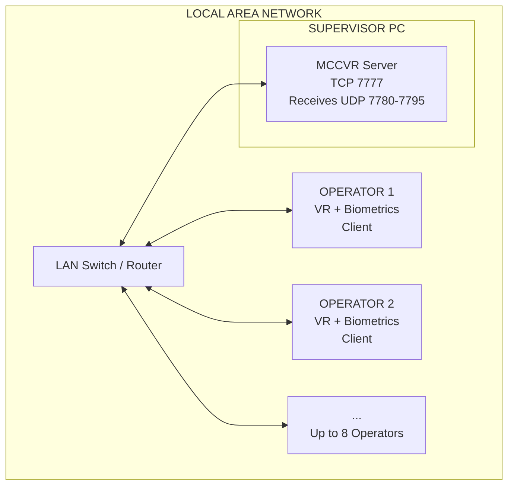

## **MCC Supervisor Setup Guide** 

Monitoring and Control Center (MCC) 

Version 1.2 | March 2026 

## **Table of Contents** 

1. Introduction 

2. Hardware Requirements 

3. Software Prerequisites 

4. Network Configuration 

5. Installation 

6. Configuring Supervisor Mode 

7. Starting a Session 

8. Supervisor Dashboard Features 

9. Data Output and File Structure 

10. Troubleshooting 

11. Appendix A: Port Reference 

12. Appendix B: Glossary 

## **1. Introduction** 

## **1.1 What is MCC?** 

MCC (Monitoring and Control Center) is a VR-based training simulator built on Unreal Engine 5.6. It enables real-time monitoring of multiple VR operators by a central supervisor. The system captures biometric data, eye tracking, CCTV camera feeds, and operator actions for training analysis and review. 

## **1.2 The Supervisor Role** 

The Supervisor is the central control station. The Supervisor computer: 

- **Hosts the game session** (acts as the listen server) 

- **Receives live camera feeds** from all connected operators via UDP streaming 

- **Monitors operator biometrics** (heart rate, stress levels, skin conductance) 

- **Tracks operator eye movements** (fixations, saccades, heatmaps) 

- **Controls training scenarios** (start, stop, trigger events) 

- **Records sessions** for later replay and analysis 

- **Generates reports** with training analytics 

The Supervisor does NOT require VR hardware -- it uses a standard desktop monitor. 

## **1.3 System Architecture** 




## **Key connections:** 

TCP 7777: Game session (Unreal Engine networking) 

- UDP 7780+N: Live camera feed streaming (one port per operator) All traffic stays on the local network 

## **2. Hardware Requirements** 

## **2.1 Minimum PC Specifications** 

|**2.1 Minimum**|**PC Specifications**||
|---|---|---|
|**Component**|**Minimum**|**Recommended**|
|**OS**|Windows 10 64-bit|Windows 11 64-bit|
|**CPU**|Intel i5 / AMD Ryzen 5 (6 cores)|Intel i7 / AMD Ryzen 7 (8+ cores)|
|**RAM**|16 GB|32 GB|
|**GPU**|NVIDIA GTX 1060 / AMD RX 580 (DX12)|NVIDIA RTX 3060 or better|
|**Storage**|50 GB SSD|100+ GB NVMe SSD|
|**Network**|Gigabit Ethernet port|Gigabit Ethernet port|
|**Display**|1920x1080 monitor|Dual monitors or ultrawide|


## **2.2 Important Notes** 

**GPU must support DirectX 12** with Shader Model 6 (SM6) 

- **No VR headset is needed** for the Supervisor 

- **Gigabit Ethernet is strongly recommended** -- WiFi is unreliable for live camera streaming **SSD storage** is important for recording session data (CCTV frames written to disk in real-time) 

## **3. Software Prerequisites** 

## **3.1 Required Software** 

|**3.1 Required Software**|||
|---|---|---|
|**Software**|**Purpose**|**Download**|
|**Windows 10/11**(64-bit)|Operating system|--|
|**GPU Drivers**(latest)|DirectX 12 + SM6 support|nvidia.com or amd.com|
|**Visual C++ Redistributables**|UE5 runtime dependency|Included with packaged build|


## **3.2 Optional (Building from Source Only)** 

|**Software**|**Purpose**|**Download**|
|---|---|---|
|**Unreal Engine 5.6**|Game engine|Epic Games Launcher|
|**Visual Studio 2022**|C++ compiler|visualstudio.microsoft.com|
|**Git**+**Git LFS**|Version control|git-scm.com|


## **4. Network Configuration** 

## **4.1 LAN Requirements** 

All machines (Supervisor + all Operators) must be on the **same local network subnet** . For example: 

- Supervisor: 192.168.1.100 

- Operator 1: 192.168.1.101 Operator 2: 192.168.1.102 

Connect all machines to the same router or network switch via Ethernet cables. 

## **4.2 Finding Your IP Address** 

1. Open **Command Prompt** (press Win+R, type `cmd` , press Enter) 

2. Type: `ipconfig` 

3. Find your **IPv4 Address** under your Ethernet adapter (e.g., `192.168.1.100` ) 

4. **Write down this IP address** -- operators will need it to connect 

## **4.3 Windows Firewall Configuration** 

The Supervisor must allow inbound connections on the following ports: 

## **Step-by-step to create firewall rules:** 

1. Open **Windows Defender Firewall with Advanced Security** (press Win, search "firewall") 

2. Click **Inbound Rules** in the left panel 

3. Click **New Rule...** in the right panel 

## **Rule 1: Game Server (TCP 7777)** 

Rule Type: Port 

Protocol: TCP Specific local ports: 7777 

- Action: Allow the connection 

- Profile: Private (or Domain if on a domain network) 

Name: "MCC Game Server" 

## **Rule 2: Camera Streams (UDP 7780-7795)** 

Rule Type: Port Protocol: UDP 

Specific local ports: 7780-7795 

Action: Allow the connection 

- Profile: Private 

Name: "MCC Camera Streams" 

_**Note:** The UDP port range 7780-7795 supports up to 16 operators. Each operator uses one port starting from 7780._ 

## **4.4 Verify Connectivity** 

After setting up the network, have each operator verify they can reach the Supervisor: 

1. On the Operator PC, open Command Prompt 

2. Type: `ping 192.168.1.100` (replace with your Supervisor IP) 

3. You should see successful replies 

## **5. Installation** 

## **5.1 Option A: Deploy Packaged Build (Recommended)** 

1. Obtain the packaged MCC build from the build server or team lead 

2. Copy the entire build folder to the Supervisor PC (e.g., `C:\MCC\` ) 

3. The folder structure should look like: 

```
C:\MCC\
├── MCC.exe                     (main executable)
├── MCC\
│   ├── Content\
│   │   ├── Configs\
│   │   │   └── Server.json     (role configuration)
│   │   └── Paks\               (game content)
│   └── Binaries\
│       └── Win64\
└── Data\                        (created at runtime)
    ├── Scenarios\
    ├── Replays\
    └── (session folders)
```

4. Run the prerequisite installer if included (installs Visual C++ Redistributables) 

## **5.2 Option B: Build from Source** 

## 1. **Clone the repository:** 

```
git lfs install
git clone <repository-url> D:\Projects\MCC
cd D:\Projects\MCC
git lfs pull
git checkout develop
```

## 2. **Open in Unreal Engine:** 

Open Epic Games Launcher Ensure UE 5.6 is installed 

Open `D:\Projects\MCC\MCC.uproject` 

## 3. **Package for Windows:** 

File > Package Project > Windows (64-bit) Build Configuration: Shipping 

Maps to include are pre-configured: EntryLobby, Lobby, ChineseEmbassy, Level_Main Wait for packaging to complete 

4. Copy the packaged output to the Supervisor PC 

## **6. Configuring Supervisor Mode** 

## **6.1 Method A: Server.json (Default)** 

The configuration file that determines the role is: 

**Packaged build:** `<ExeDir>\MCC\Content\Configs\Server.json` **Editor/Source:** `<ProjectDir>\Content\Configs\Server.json` 

Open `Server.json` in any text editor (Notepad, VS Code, etc.) and set: 

```
{
"IP": "",
"PORT": 7777
}
```

_**IMPORTANT:** The_ _`IP` field must be an_ _**empty string** (_ _`""` ) for Supervisor mode. When the IP is empty, the application starts as a listen server (Supervisor). When the IP contains a valid address, it connects as a client (Operator)._ 

## **6.2 Method B: Command-Line Launch with MULTIHOME** 

`-` As an alternative to editing Server.json, you can launch the Supervisor directly from the command line using the `MULTIHOME` flag: 

```
MCC.exe -MULTIHOME=192.168.1.100
```

Replace `192.168.1.100` with **the Supervisor PC's own IP address** on the LAN. 

## **What MULTIHOME does:** 

Tells MCC which network interface IP to bind and broadcast the server on 

Useful when the Supervisor PC has multiple network adapters (e.g., Ethernet + WiFi) and you need to specify which one to use 

Overrides the default behavior of binding to all interfaces 

## **When to use MULTIHOME:** 

When the Supervisor PC has multiple network interfaces and operators are having trouble discovering or connecting to the session 

When you want to quickly start a server without modifying Server.json When scripting or automating the launch process 

## **Example (batch file for quick launch):** 

```
@echo off
MCC.exe -MULTIHOME=192.168.1.100
```

_**Note:** When using MULTIHOME, the Server.json IP field should still be empty (or the file can be absent). MULTIHOME controls which interface the server binds to, not the role -- the role is still determined by Server.json._ 

## **6.3 Port Configuration** 

The default port is **7777** . Only change this if another application is using port 7777. If you change it, all Operators must use the same port in their Server.json. 

## **7. Starting a Session** 

## **Step-by-Step Procedure** 

1. **Verify Network** -- Ensure the Supervisor PC is connected to the LAN and you know your IP address 

2. **Verify Firewall** -- Confirm firewall rules for TCP 7777 and UDP 7780-7795 are active 

3. **Verify Server.json** -- Confirm IP is empty and PORT is set 

4. **Launch MCC** -- Either: 

Double-click the MCC executable (uses Server.json), OR 

Run from command line: `MCC.exe -MULTIHOME=<your_IP>` to bind to a specific interface 

5. **Entry Lobby** -- The application loads the Entry Lobby automatically 

6. **Listen Server Created** -- The application reads Server.json, finds empty IP, and creates a listen server on port 7777 

7. **Wait for Operators** -- Operators connect from their machines. You will see them appear in the lobby 

8. **Select Scenario** -- Choose the training scenario from the lobby interface 

9. **Start Session** -- Once all expected operators have joined, press Start to begin the training session 

10. **Travel to Training Level** -- All connected players travel to the training map (e.g., ChineseEmbassy or Level_Main) 

_**Note:** The maximum number of connected players is 16. The connection timeout is 60 seconds -- if an operator doesn't fully connect within 60 seconds, the connection attempt fails._ 

## **8. Supervisor Dashboard Features** 

Once a training session is active, the Supervisor has access to: 

## **8.1 Live Camera Feeds** 

Real-time CCTV camera streams from each operator 

- Received via UDP streaming (JPEG compressed, quality 70) Switch between operators and camera angles Supports up to 8 cameras per operator 

## **8.2 Biometric Monitoring** 

**Heart Rate** -- Live BPM from EmotiBit sensor 

- **Skin Conductance (EDA)** -- Electrodermal activity levels 

- **SCR Stress Detection** -- Automated stress event detection using: SCR Amplitude (threshold-based) 

   - SCR Rise Time 

   - SCR Frequency 

   - Z-score analysis with 5-minute baseline window 

## **8.3 Eye Tracking and Fixation Data** 

- Gaze point visualization (3D markers in the scene) Fixation events with duration and frequency Fixation targets: monitors, live walls, characters, items Saccade detection (3-degree threshold) 

## **8.4 Heatmap Visualization** 

Spatial attention heatmaps on CCTV displays 

Shows where operators focus their attention over time Configurable in DefaultGame.ini (enabled by default) 

## **8.5 CCTV Monitor System** 

Interactive CCTV monitor interface 

Pan, tilt, zoom (PTZ) camera controls Multi-monitor grid display (Live Wall) 

## **8.6 Emergency Alarm System** 

Trigger alarms and distraction events for operators Log emergency responses 

## **8.7 Action Logging** 

All operator actions are logged with timestamps Includes: camera adjustments, fixation events, interactions Stored as JSON files for post-session analysis 

## **8.8 Replay System** 

Sessions are recorded using Unreal Engine's DemoNetDriver Review any operator's session after training ends Timeline controls, operator switching, synchronized playback 

## **8.9 Report Generation** 

Export training reports as PDF via the ReportExport plugin Includes analytics, fixation data, biometric summaries 

## **9. Data Output and File Structure** 

All session data is saved under the `Data/` directory relative to the executable. 

```
Data/
├── Scenarios/                          # Pre-defined training scenarios
│   ├── Embassy.json
│   ├── EtihadParkConcert.json
│   ├── Protest.json
│   └── ShoppingMall.json
│
├── Replays/                            # Session replay files (.replay)
│
└── 2026-03-25_14-30-00/                # Session timestamp folder
    └── Supervisor/
        ├── Logs/
        │   └── Analytics/              # Supervisor-side analytics
        ├── Reports/                    # Generated PDF reports
        ├── EmergencyAlarms/            # Alarm event logs
        │
        ├── Operator_John/             # Per-operator data
        │   ├── CCTVRecordings/        # Streamed camera frames
        │   ├── Biometrics/            # EmotiBit sensor data
        │   ├── FrameMarks/
        │   │   └── Camera_0/         # Frame annotations
        │   └── Logs/
        │       └── Analytics/         # Operator action logs
        │
        └── Operator_Jane/            # Another operator
            └── (same structure)
```


_**Storage Note:** CCTV recordings can consume significant disk space. At JPEG quality 70, expect approximately 50100 MB per camera per 10-minute session. Plan storage accordingly._ 

## **10. Troubleshooting** 

## **10.1 Operators Cannot Connect** 

|**Check**|**Solution**|
|---|---|
|Same<br>network?|Verify all PCs are on the same LAN subnet|
|Firewall?|Ensure TCP 7777 inbound is allowed on Supervisor|
|Server.json?|Supervisor must have empty IP; Operator must have Supervisor's IP|
|Port conflict?|Verify port 7777 is not used by another application|
|Ping test?|Operator should be able to ping the Supervisor's IP|
|Multi-NIC?|If Supervisor has multiple network adapters, use`-MULTIHOME=<IP>`to bind to the correct<br>interface|


## **10.2 No Camera Feeds from Operators** 

|**Check**|**Solution**|
|---|---|
|UDP ports?|Ensure UDP 7780-7795 inbound are open on Supervisor|
|Bandwidth?|Use Gigabit Ethernet; WiFi may be insufficient|
|Operator running?|Verify operator is connected and in the training session|


## **10.3 No Biometric Data Visible** 

|**Check**|**Solution**|
|---|---|
|EmotiBit on operator?|Verify EmotiBit is connected and streaming on the Operator PC|
|Operator connected?|Biometrics are forwarded via game RPCs -- operator must be in-session|
|Dashboard open?|Ensure biometric panels are visible on the Supervisor dashboard|


## **10.4 Application Crashes on Launch** 

|**Check**|**Solution**|
|---|---|
|GPU drivers?|Update to latest drivers supporting DX12|
|DirectX 12?|Verify GPU supports DX12 with Shader Model 6|
|VC++ Redist?|Install Visual C++ Redistributable 2022|
|Disk space?|Ensure sufficient free disk space for Data/ folder|


## **10.5 Session Data Not Saving** 

**Check Solution** 

|Write permissions?|Ensure the Data/ folder is writable|
|---|---|
|Disk space?|Verify adequate free space|
|Antivirus?|Some antivirus may block rapid file creation; add MCC to exclusions|


## **Appendix A: Port Reference** 

|**Port**|**Protocol**|**Direction**|**Purpose**|
|---|---|---|---|
|**7777**|TCP|Inbound|Unreal Engine game server (listen server)|
|**7780**|UDP|Inbound|Camera stream - Operator 1|
|**7781**|UDP|Inbound|Camera stream - Operator 2|
|**7782**|UDP|Inbound|Camera stream - Operator 3|
|**...**|UDP|Inbound|Camera stream - additional operators|
|**7795**|UDP|Inbound|Camera stream - Operator 16 (maximum)|


_Each operator is assigned one UDP port based on their Player ID: Port = 7780 + PlayerID_ 

## **Appendix B: Glossary** 

|**Term**|**Definition**|
|---|---|
|**MCC**|Monitoring and Control Center|
|**CCTV**|Closed-Circuit Television -- in-game security camera system|
|**EDA**|Electrodermal Activity -- skin conductance measurement|
|**SCR**|Skin Conductance Response -- rapid change in EDA indicating arousal|
|**EmotiBit**|Wearable biometric sensor device|
|**Fixation**|Period where the eye remains relatively still on a target|
|**Saccade**|Rapid eye movement between fixation points|
|**Heatmap**|Visual representation of attention distribution|
|**DemoNetDriver**|Unreal Engine's built-in replay recording system|
|**Listen Server**|A game server that also acts as a player (Supervisor hosts and plays)|
|**MULTIHOME**|UE command-line flag that binds the server to a specific network interface IP|
|**OpenXR**|Cross-platform VR/AR runtime standard|
|**PTZ**|Pan-Tilt-Zoom -- camera control method|
|**Server.json**|Configuration file determining Supervisor vs Operator role|
|**UDP**|User Datagram Protocol -- used for low-latency camera streaming|
|**SM6**|Shader Model 6 -- GPU capability requirement|
|**Vive Focus Vision**|HTC standalone VR headset with PC streaming, used by Operators|


MCC Supervisor Setup Guide v1.2

